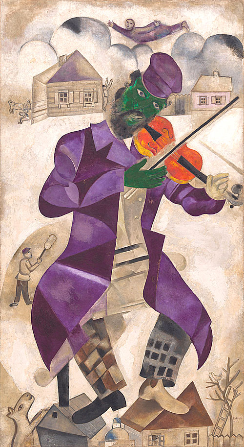

## 基本信息

- 作者：[[夏加尔 Marc Chagall]]
- 创作年代：1924
- 材质：布面油画 (*not from wiki*)
- 尺寸：约 198 × 108.6 cm (*not from wiki*)
- 现存地：纽约古根海姆博物馆 (*not from wiki*)

## 画面与技法

顾衡 077 重点品读："**熟悉的农舍和村庄又回来了。** 绿脸的小提琴手**有哥斯拉那么大**，却**一点儿也不可怕**。他**戴着可笑的紫色帽子**，**穿着被分解成几何图形的紫色大衣**——给**被歧视和凌辱到社会最底层的沙俄犹太社区**，带来**片刻的欢乐与安慰**。"

画面元素：

- 绿脸 / 巨人尺度 / 紫帽 / 几何化的紫大衣（[[立体主义 Cubism]] 残影）
- 背景：维切布斯克的木质农舍、雪地、犹太村庄
- 小提琴手——犹太村庄民俗中的核心人物（婚礼、节日的灵魂），夏加尔反复使用的母题

## 历史背景 (*not from wiki*)

1923 年夏加尔重返巴黎后所作。顾衡评："**到巴黎后，夏加尔的创作更加自闭，更加富于幻想，作品中梦境的意味越来越明显。**" 小提琴手 (*klezmer* / fiddler) 是东欧犹太村庄的标志符号——后来《屋顶上的小提琴手》(*Fiddler on the Roof*) 即以此原型。

## 图片清单

| 编号 | 出自 | 描述 |
|---|---|---|
| 01 | [[077｜夏加尔：俄国人在巴黎]] | 哥斯拉尺度的绿脸小提琴手 + 紫帽紫大衣 + 维切布斯克农舍背景 |

## 出现在

- [[077｜夏加尔：俄国人在巴黎]] —— 顾衡品读：给沙俄犹太社区的片刻欢乐
