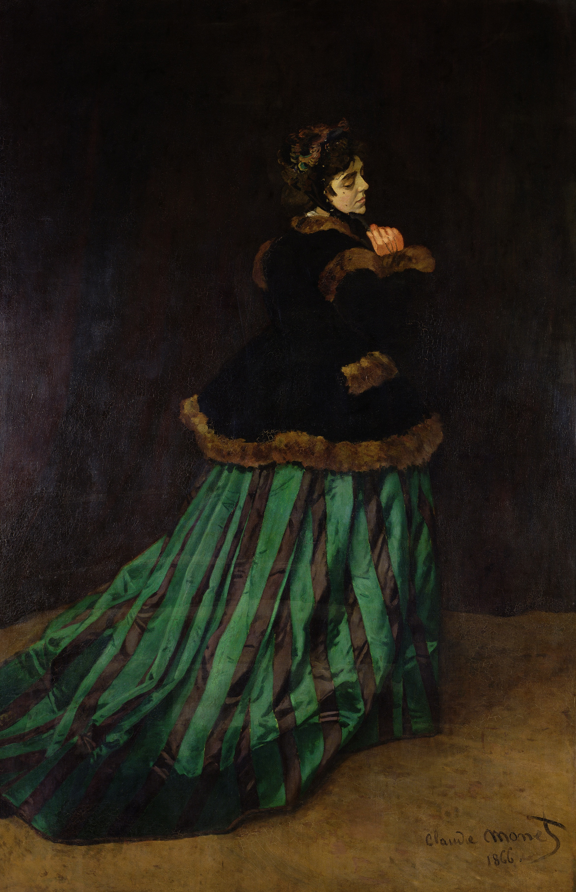

## 基本信息

- 作者：[[莫奈 Claude Monet]]
- 创作年代：1866（041 caption）
- 材质：布面油画 (*not from wiki*)
- 尺寸：约 231 × 151 cm (*not from wiki*)
- 现存地：(*not from wiki*) —— 不来梅美术馆 Kunsthalle Bremen

## 画面与技法

模特：[[卡美伊·东西厄 Camille Doncieux]]——莫奈当时的女朋友、后来的妻子。这幅大型立像让 24 岁的莫奈在 1866 年第二次入选 [[巴黎沙龙 Paris Salon]]。

(*not from wiki*) 画面是侧身回首的全身像，绿色条纹长裙——技法上仍带学院派的精细处理，颇受沙龙评委青睐。但已经显露莫奈对**质料感（裙料的厚重、阴影的处理）**的真切观察。

## 历史背景

041 顾衡的叙事节点：
1. 这是莫奈被认可的高峰之一——**1866 年莫奈卖画收入达到 12,000 法郎，是普通公务员年收入的 8 倍**
2. 但紧接着是断崖式跌入低谷——"**卡美伊太年轻了，完全不懂怎么持家理财，而且还怀孕了。很快莫奈就负债累累，日子过得是屁滚尿流**"
3. 这是 [[巴齐依 Frédéric Bazille]] 必须以分期付款方式买《[[花园里的女人 Women in the Garden]]》救济莫奈的前置因果

## 图片清单

| 编号 | 出自 | 描述 |
|---|---|---|
| 01 | [[041｜莫奈1：颠覆式的创新从何而来？]] | 卡美伊穿绿色条纹长裙、侧身回首 |

## 出现在

- [[041｜莫奈1：颠覆式的创新从何而来？]]
