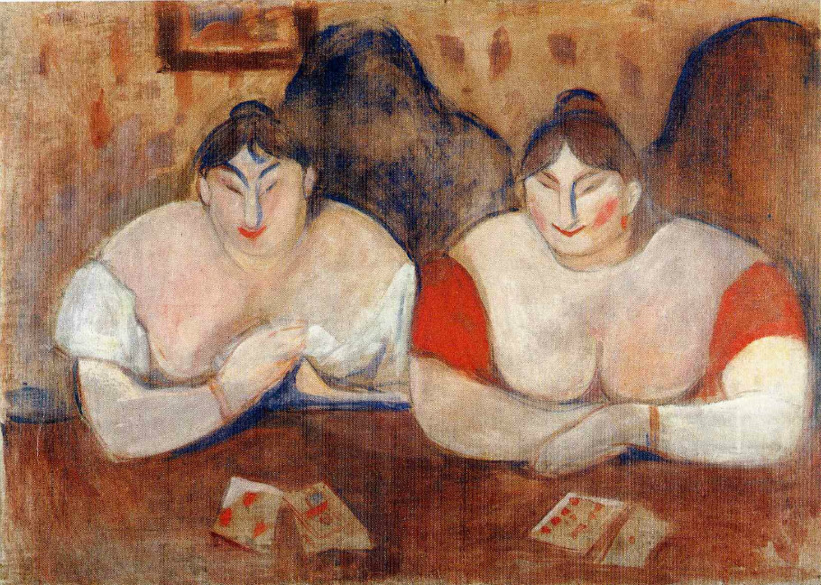

## 基本信息

- 作者：[[爱德华·蒙克 Edvard Munch]]
- 创作年代：1894
- 材质：布面油画 (*not from wiki*)
- 尺寸：未注明
- 现存地：未注明

## 画面与技法

蒙克象征主义时期的双女子像——两位巴黎妓院模特罗斯与艾美莉（*not from wiki*）。属顾衡 070 列举的与 [[呐喊 The Scream]] 同质的**情感程式化**组——画面外化的是蒙克对女性的复杂凝视，与同时期 [[吸血鬼 Vampire]]、[[嫉妒 Jealousy]] 共同构成"女人母题"群组。

## 历史背景 (*not from wiki*)

蒙克在巴黎期间频繁画妓院女子，与其北欧老家姐姐去世的童年创伤、与对女性的疏离 / 渴望同源——是 [[爱组画 The Frieze of Life]] 的边缘试作。

## 图片清单

| 编号 | 出自 | 描述 |
|---|---|---|
| 01 | [[070｜蒙克1：表现主义的先行者经历了什么？]] | 两位女子像 |

## 出现在

- [[070｜蒙克1：表现主义的先行者经历了什么？]]
