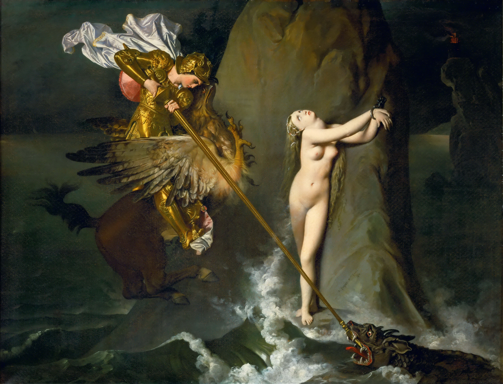

## 基本信息

- 作者：[[安格尔 Jean-Auguste-Dominique Ingres]]
- 创作年代：1819
- 材质：布面油画 (*not from wiki*)
- 尺寸：147 × 199 cm (*not from wiki*)
- 现存地：(*not from wiki*) 卢浮宫

## 画面与技法

题材取自**阿里奥斯托 (Ariosto)《疯狂的奥兰多》(Orlando furioso, 1532)** —— 海怪奥鲁克 (Orca) 将女王安吉莉卡抓来当祭品；千钧一发之际英雄罗杰骑着**半鹰半马的座骑 (Hippogriff)** 杀死海怪、救下安吉莉卡。

**画面焦点的故意偏移** —— 顾衡 032 关键论述：

> "在作品中，安格尔把心思全部放在表现女性的胴体之美，以及铠甲的金属质感等细节上了。"

> "**最重要的，人物的情感，却是缺失的。** 罗杰表情淡漠，不像是正在用长矛杀海怪，**倒像用牙签戳一块锅包肉**。安吉莉卡更是面无表情，一副置身事外的样子。头向后仰着，翻着白眼，**像是正在心算 8+5 等于几**。"

**这种姿态与神情，与强调情感渲泄的 [[浪漫主义 Romanticism]] 直接唱反调** —— **遭恶评如潮**。但顾衡指出："但是安吉莉卡美不美？美！对于安格尔来说，这就足够了。"

## 历史背景

> 顾衡 032 的关键结论："**对线条和细节的过分强调，一个必然的结果就是作品叙事性的丧失。而叙事性的丧失所带来的意义的抽象和疏离，正是安格尔想要的。** 他就是想让艺术回到不问政治、对文人的聒噪不理不睬的自闭状态。在这个远离尘嚣的角落里，他能够全神贯注于一件事：**表现女性胴体之美**。"

本作是安格尔**"[[政治与艺术防火墙 The Wall between Politics and Art]]"策略的视觉范本**——通过故意制造叙事性丧失，把艺术抽离于政治与文人评判，**专注于女性胴体的形式探究**。

## 图片清单

| 编号 | 出自 | 描述 |
|---|---|---|
| 01 | [[032｜安格尔：为什么他是学院派最后一位大师？]] | 整体画面 |

## 出现在

- [[032｜安格尔：为什么他是学院派最后一位大师？]]
