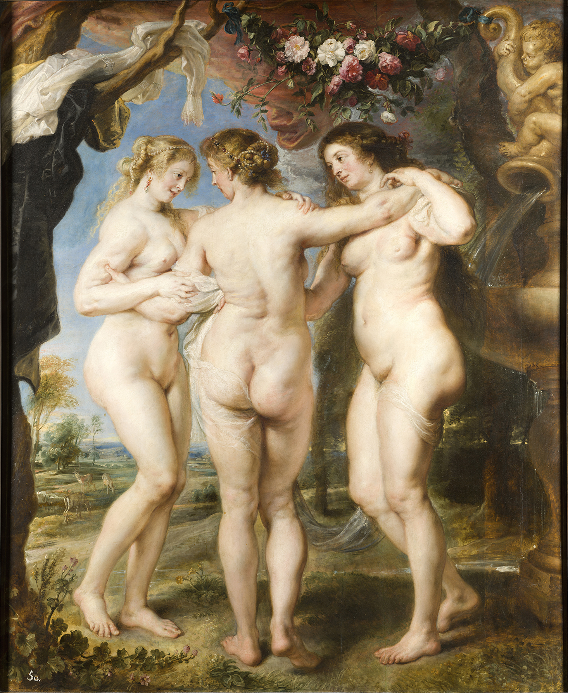

## 基本信息

- 作者：[[鲁本斯 Peter Paul Rubens]]
- 创作年代：约 1630–1635
- 材质：木板油画 (*not from wiki*)
- 尺寸：约 220 × 180 cm (*not from wiki*)
- 现存地：马德里普拉多博物馆 Museo del Prado, Madrid (*not from wiki*)

## 画面与技法

题材出希腊罗马神话——美惠三女神（Aglaea / Euphrosyne / Thalia），是阿弗洛狄忒的随从，代表光辉、欢乐、繁荣。鲁本斯把三女神画成**三个肉感丰盈的佛兰德斯妇人**——屁股、大腿、腰部的赘肉**一道一道清晰可见**。

**顾衡用本作作为"鲁本斯的女人太胖"的代表样本**——连同时代人都受不了。鲁本斯的回答是："**我们佛兰德斯人吃的和你们意大利人不一样**。"

(*not from wiki*) 据传中间偏左的女神面容据其第二任妻子 Helena Fourment 所绘——鲁本斯 1626 第一任妻子伊莎贝拉去世后于 1630 续弦，新娘 16 岁。

## 历史背景

(*not from wiki*) 鲁本斯晚期为自己所作（非订单画），始终保留私藏直至 1640 去世。后入西班牙国王腓力四世收藏，再入普拉多至今。

## 图片清单

| 编号 | 出自 | 描述 |
|---|---|---|
| 01 | [[024｜鲁本斯：都是巴洛克，为什么风格如此不同？]] | 三女神并立，背面 / 正面 / 侧面三视角 |

## 出现在

- [[024｜鲁本斯：都是巴洛克，为什么风格如此不同？]]
