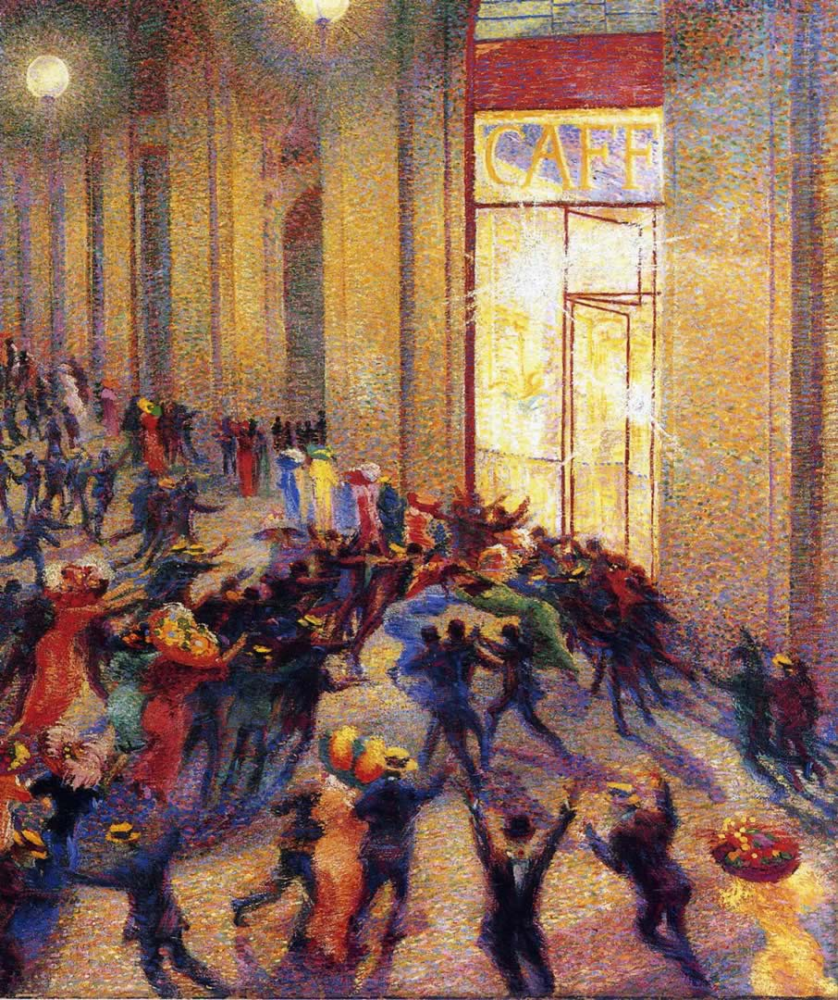

## 基本信息

- 作者：[[波丘尼 Umberto Boccioni]]
- 创作年代：1910
- 材质：布面油画 (*not from wiki*)
- 尺寸：76 × 64 cm (*not from wiki*)
- 现存地：米兰 Pinacoteca di Brera (布雷拉美术馆) (*not from wiki*)

## 画面与技法

(*not from wiki*) 标题中 "Galleria" 通常指米兰 **Galleria Vittorio Emanuele II 拱廊**——画面记录了拱廊里夜晚一场人群骚乱，[[波丘尼 Umberto Boccioni]] 用**放射状群像 + 强烈对比的灯光**把"暴力"主题词视觉化。

## 历史背景

(*not from wiki*) 与《[[城市的兴起 The City Rises]]》同年，标志波丘尼正式投入 [[未来主义 Futurism]] 绘画——把现代都市夜生活的喧嚣与对峙作为题材。

## 图片清单

| 编号 | 出自 | 描述 |
|---|---|---|
| 01 | [[080｜什么是未来主义？]] | 整体图 |

## 出现在

- [[080｜什么是未来主义？]]
