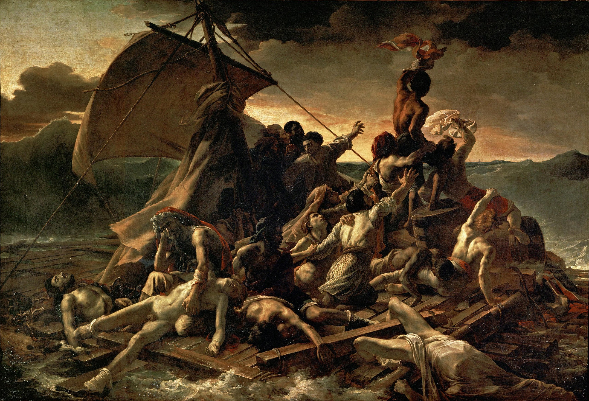

## 基本信息

- 作者：[[籍里柯 Théodore Géricault]]
- 创作年代：1818–1819
- 材质：布面油画 (*not from wiki*)
- 尺寸：(*not from wiki*) 491 × 716 cm
- 现存地：(*not from wiki*) 巴黎卢浮宫

## 画面与技法

(*not from wiki*) 巨幅历史画：13 天海上漂流后**奄奄一息的幸存者**堆在简陋木筏上，画面构图沿对角线由左下死尸 → 中部呼喊 → 右上一名黑人挥布向远方求救——金字塔式上升的人体堆是 [[米开朗基罗 Michelangelo]] 式的**解剖学塑造**与 [[卡拉瓦乔 Caravaggio]] 式的**酒窖光戏剧性**的合体。海面、天空都被压成深褐与铅灰，连"地平线上的救援船"都几乎看不见——情绪的强度盖过了胜利的预告。

为画此作，籍里柯**真的跑到医院去做了大量临终者素描**——尸体的颜色、肌肤的塌陷、僵直的姿态都来自现场观察 (*not from wiki* 关于"医院素描"是顾衡 034 转述)。

## 历史背景

**1816 年**美杜莎号军舰从法国驶往殖民地塞内加尔途中**发生海难**——船长（**职务花钱买的**）带高级船员坐救生艇先跑了，剩下 147 人坐在木筏上漂了 13 天，获救时只剩 15 人活着，上岸又死 5 人。**全社会轰动**，丑闻直接打脸波旁复辟王朝的腐败用人。

1819 沙龙首展即引发剧烈反响：
- **美术界评价不高**——[[安格尔 Jean-Auguste-Dominique Ingres]] 公开骂："我不想看这种东西，这只能算是解剖学的表演，展现在人们面前的是死尸样的人物，实在败坏观赏者的趣味。"
- **报纸上的文人评价极高**——"**这个木筏就像法兰西，我们每个人都在木筏上，人人感同身受，这就是浪漫主义的绘画呀！**"

顾衡 034 把本画立为"**浪漫主义绘画的开张标志**"——继音乐、文学、戏剧之后，浪漫主义首次有了**绘画**代表作。

## 在课程中的角色

- 第一次实证：**报纸上的评论家** vs **学院派**对同一幅画的评价彻底背离——评论家话语权的雏形开始显现；
- 第二次实证：**籍里柯**因此成为浪漫主义一哥；
- 关键转折：本画给**德拉克罗瓦**带来**极大触动**——籍里柯让他到画室来看尚未完成的本作后，"**德拉克罗瓦激动得一路跑回了家，发誓以后也要这样创作**"——这是 [[但丁和维吉尔共渡冥河 The Barque of Dante]] (1822) 的直接起因。

## 图片清单

| 编号 | 出自 | 描述 |
|---|---|---|
| 01 | [[034｜德拉克罗瓦：为什么他成了浪漫主义的旗手？]] | 全画 |

## 出现在

- [[034｜德拉克罗瓦：为什么他成了浪漫主义的旗手？]] —— 浪漫主义绘画的开张标志
