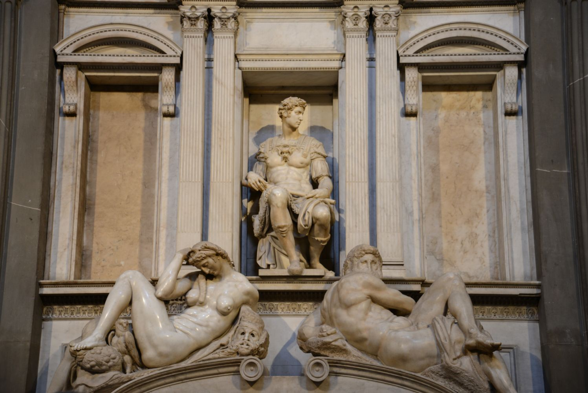
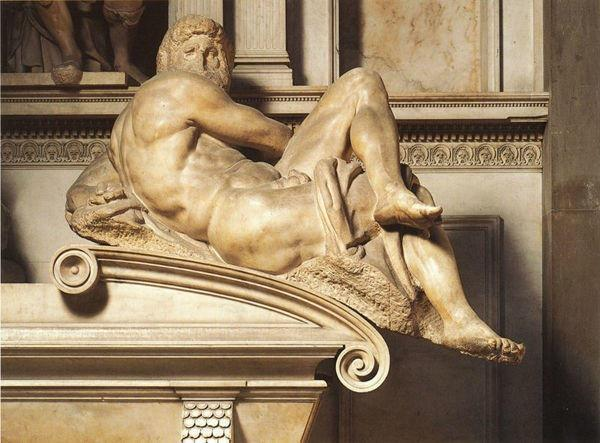

## 基本信息

- 作者：[[米开朗基罗 Michelangelo]]
- 创作年代：1519–1534 (*not from wiki*)
- 材质：大理石雕塑 + 同设计的建筑空间
- 尺寸：每尊真人尺寸，礼拜堂建筑约 15 m 高
- 现存地：佛罗伦萨圣洛伦佐教堂的"新圣器室" (Sagrestia Nuova, San Lorenzo, Firenze)

## 画面与技法

**美第奇家族家族墓地教堂** —— 两座对面墓中央各有一位美第奇家族成员雕像，下方躺着象征时间的两对寓言雕塑：

**洛伦佐·迪·皮耶罗·美第奇** 墓 (面壁右侧)：
- 中央：洛伦佐 (沉思相)
- 下方：**晨 Dawn** (女性，刚被唤醒) + **暮 Dusk** (男性，老态)

**朱利亚诺·迪·洛伦佐·美第奇** 墓 (面壁左侧)：
- 中央：朱利亚诺 (战士相)
- 下方：**夜 Night** (女性，沉睡) + **昼 Day** (男性，**未完成**)

形式上的特征：

- **古典河神姿势**——下方四位时间寓言斜倚的姿态借自古罗马河神雕塑
- **躯体的扭转 (contrapposto)** 极致——尤其 *Night* 的扭曲构图，影响了后世矫饰主义和巴洛克
- **《昼》(Day) 显然没有完成**——脸部基本只是石块，"米开朗基罗不厚道的地方"

## 历史背景

(*not from wiki*) 教皇 [[利奥十世]] (洛伦佐·美第奇之子) 委托米开朗基罗回到佛罗伦萨为美第奇家族修建家族墓地教堂。1519 起施工，1534 年教皇克莱芒七世 (也是美第奇家族) 去世后**米开朗基罗草草收摊，把半成品交付**——把《昼》未完成留在那儿。

但这种"未完成"反而产生了**类似中国画"留白"的效果**——大大增强了作品的感染力，**观众面对未完成作品时会调动想像力参与**。米开朗基罗自己深受启发，晚年沉浸 [[未完成性 Non-finito]] 的探索，结晶为 [[隆达尼尼的圣母怜子 Rondanini Pietà]]。

利奥十世为何选米开朗基罗：尽管教皇不喜欢他这个人（米开朗基罗在 1494 美第奇被推翻时没表现政治忠诚 + 性格狂妄），但承认他是**最高水平的雕塑家**——艺术品味战胜了个人好恶。这也是 [[利奥十世]] 后来同时养着米开朗基罗 + 极度边缘化 [[达·芬奇 Leonardo da Vinci]] 但重用 [[拉斐尔 Raphael]] 的三角格局。

## 图片清单

| 编号 | 出自 | 描述 |
|---|---|---|
| 01 | [[012｜米开朗基罗：他为什么能被艺术史家"封神"？]] | 左：暮 / 中：洛伦佐 / 右：晨 |
| 02 | [[012｜米开朗基罗：他为什么能被艺术史家"封神"？]] | 左：夜 / 中：朱利亚诺 / 右：昼 |
| 03 | [[012｜米开朗基罗：他为什么能被艺术史家"封神"？]] | 局部：未完成的《昼》面部特写 |

## 出现在

- [[012｜米开朗基罗：他为什么能被艺术史家"封神"？]]
