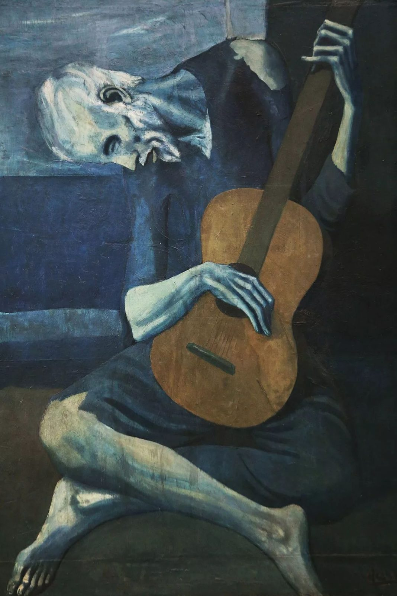

## 基本信息

- 作者：[[毕加索 Pablo Picasso]]
- 创作年代：1903
- 材质：木板油画 (*not from wiki*)
- 尺寸：122.9 × 82.6 cm (*not from wiki*)
- 现存地：芝加哥艺术博物馆 (Art Institute of Chicago) (*not from wiki*)

## 画面与技法

[[毕加索 Pablo Picasso]] [[蓝色时期 Blue Period]] **定型阶段最著名的作品之一**——本讲将其与 [[两姐妹 (毕加索) The Two Sisters (Picasso)]]、[[海边的可怜人 The Poor by the Sea]]、[[人生 (毕加索) La Vie]]、[[烫衣服的女人 Woman Ironing]] 一同列为 **"强烈同质性"的样本**：毕加索第一次形成属于自己的风格。

风格特征：

- **[[夏凡纳 Pierre Puvis de Chavannes]] 式简化**——构图大胆删减、人物剪影化、追求"意在画外"。
- **[[埃尔·格列柯 El Greco]] 式 [[矫饰主义 Mannerism]]**——盲老人四肢细长到不真实、身体扭折成"S"形几乎填满画面（参考 [[圣安德鲁与圣弗朗西斯 St. Andrew and St. Francis]]）。
- 单色调蓝色饱和——所有暖色被几乎完全压制。

## 历史背景 (*not from wiki*)

- 创作于巴塞罗那，是毕加索在 1903 年回西班牙期间的产物。
- 母题"盲乐者"延续中世纪以来的乞讨乐手图像志，与同期的 [[海边的可怜人 The Poor by the Sea]] 共同构成蓝色时期的"边缘人/社会底层"题材链。
- X 射线显示画下有更早的另一幅作品被覆盖。

## 图片清单

| 编号 | 出自 | 描述 |
|---|---|---|
| 01 | [[064｜毕加索1：如何理解"蓝色时期"和"玫瑰红时期"？]] | 整幅画面 |

## 出现在

- [[064｜毕加索1：如何理解"蓝色时期"和"玫瑰红时期"？]]
