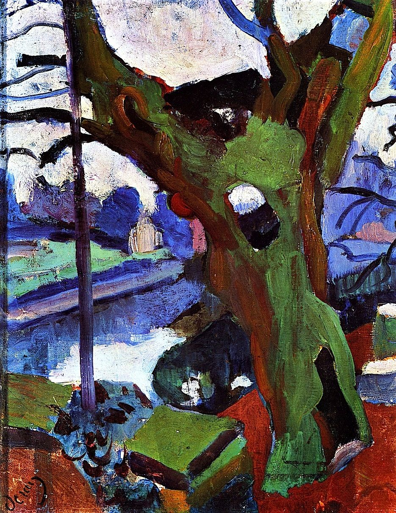

## 基本信息

- 作者：[[德朗 André Derain]]
- 创作年代：1904
- 材质：油彩，画布 (*not from wiki*)
- 现存地：(*not from wiki*)

## 画面与技法

[[德朗 André Derain]] 1904 年的早期作品。这一时期 [[德朗 André Derain]] 与 [[马蒂斯 Henri Matisse]]、[[弗拉芒克 Maurice de Vlaminck]] 经常在一起创作 (顾衡 063："从 1903 年到 1906 年，马蒂斯、德朗和弗拉芒克这三个人经常在一起创作")。本作仍处于 [[野兽派 Fauvism]] **正式得名前夜**——色彩已开始放松约束，但尚未达到 1905 Collioure 之夏后的爆炸式纯色。

## 历史背景 (*not from wiki*)

- 1903–1906 是 [[德朗 André Derain]] 风格成形的关键三年——与 [[马蒂斯 Henri Matisse]]、[[弗拉芒克 Maurice de Vlaminck]] 频繁交流；共同基底是对 [[塞尚 Paul Cézanne]] 的热爱。
- 顾衡 063 把本作作为 "德朗早期作品深受 [[塞尚 Paul Cézanne]] 影响" 的样本之一。

## 图片清单

| 编号 | 出自 | 描述 |
|---|---|---|
| 01 | [[063｜野兽派，除了马蒂斯还能谈什么？]] | 整幅画面——德朗 1904 早期作品 |

## 出现在

- [[063｜野兽派，除了马蒂斯还能谈什么？]] —— 作为德朗野兽派得名前夜的过渡样本
