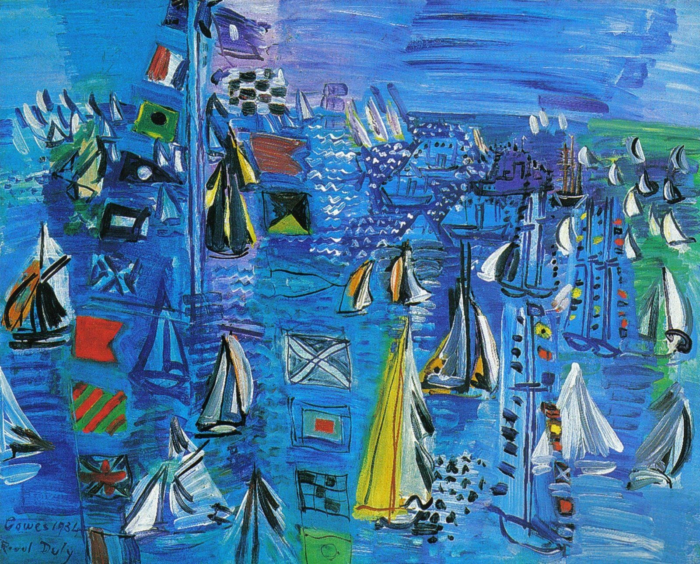

## 基本信息

- 作者：[[杜菲 Raoul Dufy]]
- 创作年代：1934
- 材质：油彩，画布 (*not from wiki*)
- 现存地：(*not from wiki*)

## 画面与技法

[[杜菲 Raoul Dufy]] 1934 年代表作。顾衡 063 称其"**淋漓尽致地反映了他的风格特点**"，并明确解析杜菲的两步工作法：

1. **先在画布上薄薄地涂上一层明快的色彩**；
2. **然后再像原始人那样，用简洁、质朴和笨拙的线条，来勾画物体的轮廓**。

——这就是后来被冠以"**杜菲式画风**"的两层叠加法。色与形**分离独立**：色块平涂、铺底；线条另起一层勾边、不与色块重合——画面因此既有装饰性的平面感，又有原始的拙朴感。

杜菲也偏爱**让很多小东西充斥着画面**——很符合小孩子的特点，也是他对超现实主义画家 [[米罗 Joan Miró]] 产生影响的根源 (顾衡 063 明示)。

## 历史背景 (*not from wiki*)

- 考斯 (Cowes) 是英国怀特岛上的传统帆船赛举办地——杜菲多次以帆船赛为主题，构成他海港+体育题材系列的核心。
- 1934 年杜菲已是欧洲装饰画派的代表人物之一。

## 图片清单

| 编号 | 出自 | 描述 |
|---|---|---|
| 01 | [[063｜野兽派，除了马蒂斯还能谈什么？]] | 整幅画面——杜菲式两层叠加法的代表作 |

## 出现在

- [[063｜野兽派，除了马蒂斯还能谈什么？]] —— 杜菲风格的核心样本 (色块+线条分离)
