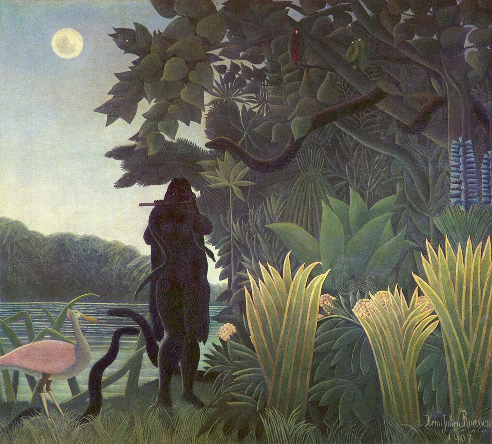

## 基本信息

- 作者：[[亨利·卢梭 Henri Rousseau]]
- 创作年代：1907
- 材质：布面油画 (*not from wiki*)
- 尺寸：169 × 189 cm (*not from wiki*)
- 现存地：巴黎奥赛博物馆 / Musée d'Orsay (*not from wiki*)

## 画面与技法

丛林母题、月夜剪影、迷蛇女吹笛、繁密的植被。
顾衡 079 重点："每片叶子都是正面朝向观众的，看上去和咱们这边不入流的年画一模一样"——**正面化、装饰性、程式化**。

## 历史背景

1907 年，卢梭的丛林系列日渐成熟。这一时期他没去过热带，全凭巴黎植物园观察 + 想象，但其密林视觉系统已经成型。本作如今为奥赛博物馆藏品。

## 图片清单

| 编号 | 出自 | 描述 |
|---|---|---|
| 01 | [[079｜亨利·卢梭：毕加索对他的吹捧是真心的吗？]] | 全图：月夜丛林、吹笛迷蛇女、莲叶 |

## 出现在

- [[079｜亨利·卢梭：毕加索对他的吹捧是真心的吗？]]
