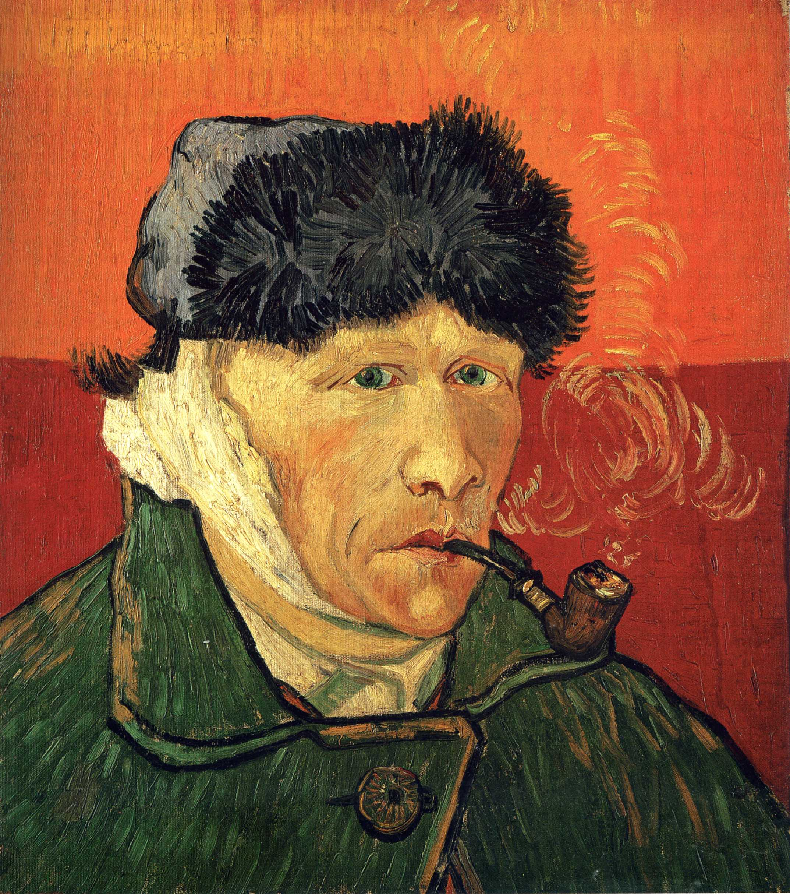

## 基本信息

- 作者：[[凡·高 Vincent van Gogh]]
- 创作年代：1889
- 材质：布面油画 (*not from wiki*)
- 尺寸：51 × 45 cm (*not from wiki*)
- 现存地：私人收藏（另有版本藏伦敦考陶尔德画廊）(*not from wiki*)

## 画面与技法

1888 年 12 月 23 日凡·高与高更激烈冲突后割下自己左耳，由此进入反复发作的精神崩溃。本作描绘他出院后右耳缠绕白色绷带（镜像后呈左耳）的形象，叼着烟斗，背景为铬黄底色。

## 历史背景 (*not from wiki*)

割耳事件是 19 世纪艺术史最著名的精神病发作。事件经过有多种版本：高更称凡·高曾欲以剃刀袭击他，但割耳后高更最初对朋友讲述时并无此情节——顾衡 059 据此判定"高更多半是撒谎"。

## 图片清单

| 编号 | 出自 | 描述 |
|---|---|---|
| 01 | [[059｜凡·高3：他为什么走向毁灭？]] | 出院后叼烟斗的自画像 |

## 出现在

- [[059｜凡·高3：他为什么走向毁灭？]]
