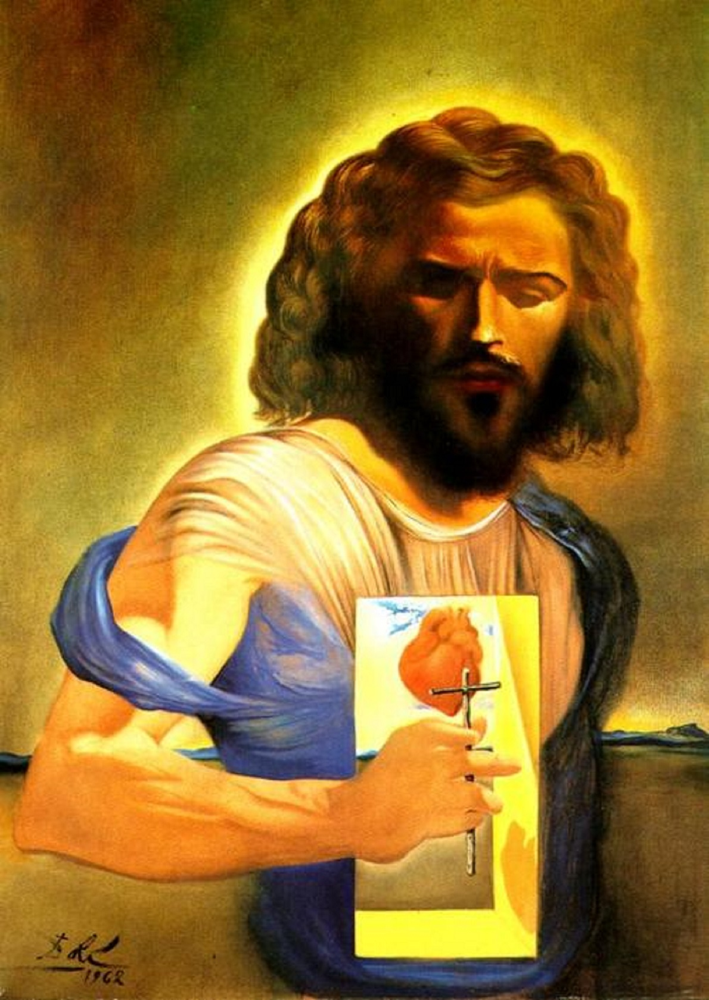

## 基本信息

- 作者：[[达利 Salvador Dalí]]
- 创作年代：1962
- 材质：布面油画 (*not from wiki*)
- 尺寸：年代不详
- 现存地：(*not from wiki*) 私人收藏

## 画面与技法

094 中作为达利**晚年皈依天主教**之后宗教画的代表作之一出场——顾衡：

> "晚年的达利，又皈依了天主教，他画了很多非常精彩的宗教画作，比如《耶稣圣心》和《[[十字架上的圣约翰基督 (达利) Christ of Saint John of the Cross]]》，为此还得到了谒见教皇的机会。"

(*not from wiki*) 题材是天主教传统的 "耶稣圣心"（Sacred Heart）——耶稣袒胸示出燃烧的心脏。达利把母题嫁接到自己的核神秘主义视觉语汇——精确写实笔法 + 宇宙级背景。

## 历史背景 (*not from wiki*)

达利晚年（1950–1970 年代）的天主教绘画系列让他获得了 1949 与 1959 年两次梵蒂冈谒见教皇（庇护十二世、约翰二十三世）的机会——为一个曾被超现实主义同行视为"无神论者旗手"的画家，这种身份反转是 094 重点强调的人生弧线。

## 图片清单

| 编号 | 出自 | 描述 |
|---|---|---|
| 01 | [[094｜达利：为什么他画的是"伪装的梦"？]] | 全图 |

## 出现在

- [[094｜达利：为什么他画的是"伪装的梦"？]]
