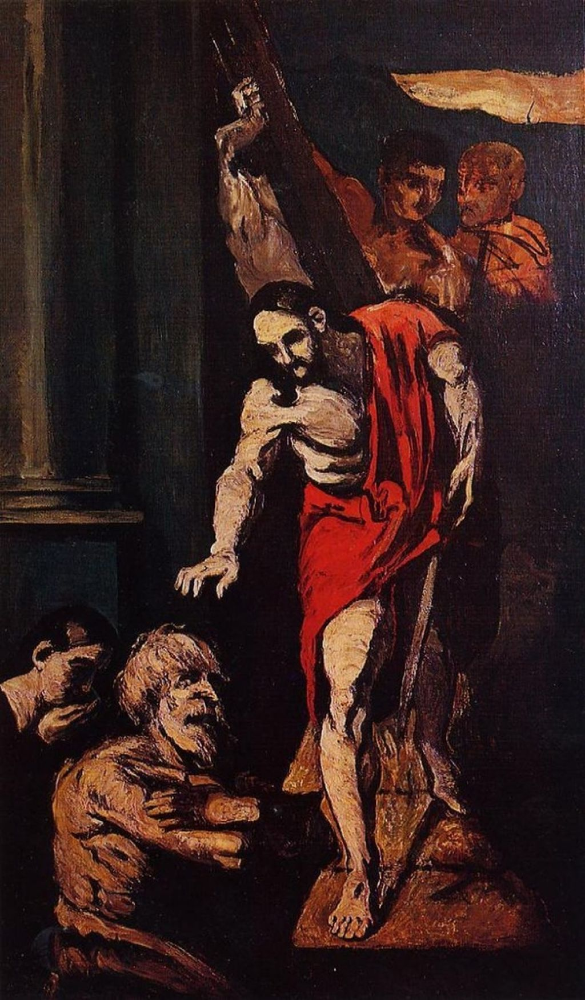

## 基本信息

- 作者：[[塞尚 Paul Cézanne]]
- 创作年代：1867
- 材质：油彩，画布 (*not from wiki*)
- 尺寸：(*not from wiki*) 约 170 × 97 cm
- 现存地：(*not from wiki*) 私人收藏 / 巴黎奥赛博物馆

## 画面与技法

塞尚 1867 年宗教题材习作，描绘耶稣下到灵薄狱（Limbo）救出旧约义人的瞬间。**(*not from wiki*)** 此画构图取自塞巴斯蒂亚诺·德尔皮翁博（Sebastiano del Piombo）的同名作品——塞尚正于这一时期 **"每天去卢浮宫临摹大师们的画作，深受 [[鲁本斯 Peter Paul Rubens]] 和 [[德拉克罗瓦 Eugène Delacroix]] 的影响"**（052）。

顾衡 052 把此画放在 **"塞尚要的是'画我所想'、脑子里充满了幻想"** 的论述段落中：塞尚一开始就对客观再现不感兴趣——宗教幻象题材正契合这一倾向。

技法上典型体现塞尚此期 **"色刀厚涂 + 阔大笔触 + 未完成感"** 的组合。

## 历史背景 (*not from wiki*)

题材"灵薄狱（Limbo）"出自天主教传统——基督受难后、复活前下到地狱边缘，把亚当、夏娃等旧约义人救出。塞尚选择此宗教幻象题材，是他早期 "脑袋里充满幻想" 的典型出口。

## 图片清单

| 编号 | 出自 | 描述 |
|---|---|---|
| 01 | [[052｜塞尚1：为什么他是西方现代绘画之父？]] | 全图 |

## 出现在

- [[052｜塞尚1：为什么他是西方现代绘画之父？]]
