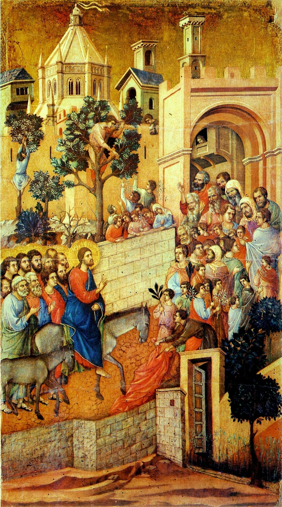

## 基本信息

- 作者：[[杜乔 Duccio]]
- 创作年代：1308–1311
- 材质：蛋彩、木板 (tempera on panel) (*not from wiki*)
- 尺寸：约 100 × 57 cm (*not from wiki*)
- 现存地：意大利锡耶纳 · 锡耶纳主教座堂博物馆 (Museo dell'Opera del Duomo, Siena) (*not from wiki*) —— 原属 [[宝座上的圣母子 (杜乔) Maestà]] 大祭坛画的背面叙事板之一

## 画面与技法

锡耶纳画派 [[杜乔 Duccio]] 的 **《Maestà 圣母赞美》** 大祭坛画背面 **基督受难叙事循环** 的一格——表现福音书中棕枝主日基督骑驴进入耶路撒冷的场景。**人物造型程式化、城门与树木简化为符号化的几何块面**——这种 **简化的画面元素**，正是 [[夏凡纳 Pierre Puvis de Chavannes]] 在 19 世纪所倾心借鉴的源头。

## 历史背景 (*not from wiki*)

杜乔的 *Maestà* (1308–1311) 是锡耶纳大教堂的主祭坛画，1311 年 6 月 9 日游行入堂时全城停业庆祝——是中世纪锡耶纳市民生活的标志性事件。19 世纪以后该祭坛画被拆解，背面叙事板分藏多处。

## 图片清单

| 编号 | 出自 | 描述 |
|---|---|---|
| 01 | [[049｜夏凡纳：如何制作象征主义的密电码？]] | 整幅画面 |

## 出现在

- [[049｜夏凡纳：如何制作象征主义的密电码？]] —— 作为 [[夏凡纳 Pierre Puvis de Chavannes]] 真正师承的样本被引用
