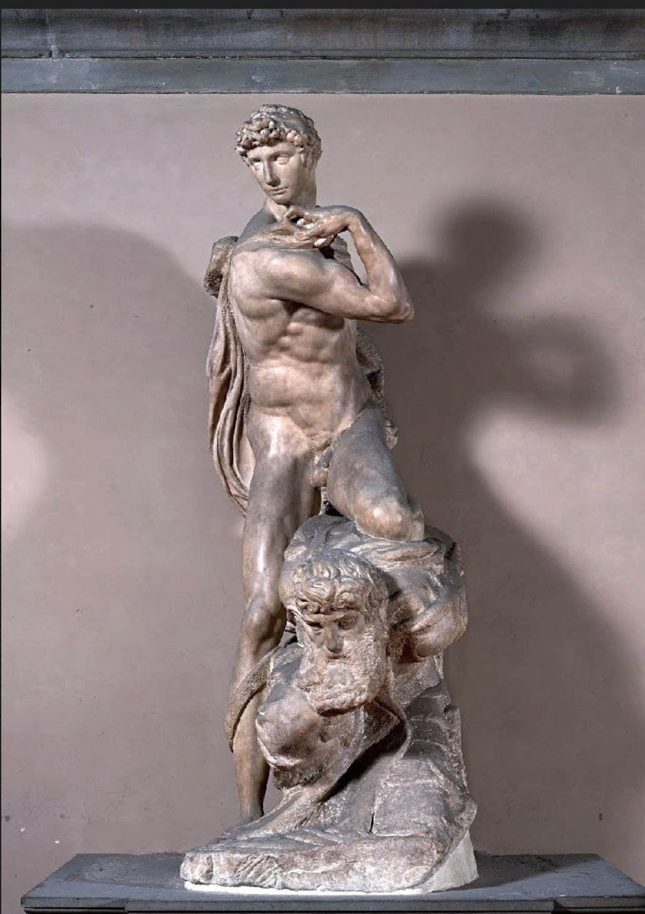

## 基本信息

- 作者：[[米开朗基罗 Michelangelo]]
- 创作年代：1532–1534 (*not from wiki*)
- 材质：大理石
- 尺寸：高 261 cm (*not from wiki*)
- 现存地：佛罗伦萨韦奇奥宫 (Palazzo Vecchio) (*not from wiki*)

## 画面与技法

**英俊年轻的战士** (Victory) 站立扭身——脚下踩着一个**蓄须的老人**（被击败的敌人）。年轻人面容平静、肌肉发达；老人扭曲挣扎、面露苦相。

**关键八卦**：顾衡 013 暗示——年轻战士的面容就是**米开朗基罗心爱的男人 托马索·卡瓦列里 (Tommaso de' Cavalieri, c.1509–1587)**；脚下被踩的老人则是米开朗基罗的自我投射。米开朗基罗终生把这件雕像**摆在工作室里不离左右**——这件雕塑是他**私密的爱情纪念物**。

形式上：身体的扭转 (contrapposto extreme) 几乎将整个躯干上半部分扭转 180°——是米开朗基罗晚期 [[矫饰主义 Mannerism]] 倾向的早期实例 (*not from wiki*)。

## 历史背景

(*not from wiki*) 原属 [[教皇尤利乌斯二世陵寝 Tomb of Pope Julius II]] 系统中的"奴隶"组群——但米开朗基罗最终没将其交付，**自己留下来摆在工作室**。他去世后 (1564) 雕像归侄孙 Leonardo Buonarroti 所有；后由佛罗伦萨大公科西莫一世收藏，置韦奇奥宫至今。

米开朗基罗写给托马索·卡瓦列里的情诗 (公开发表的)：**为了"掩人耳目"还假模假式坚持给一个女人写了好几年情诗**——但所有人都知道他真正爱的是托马索。

## 图片清单

| 编号 | 出自 | 描述 |
|---|---|---|
| 01 | [[013｜恩怨：文艺复兴三杰如何相互影响？]] | 整体图 |

## 出现在

- [[013｜恩怨：文艺复兴三杰如何相互影响？]]
