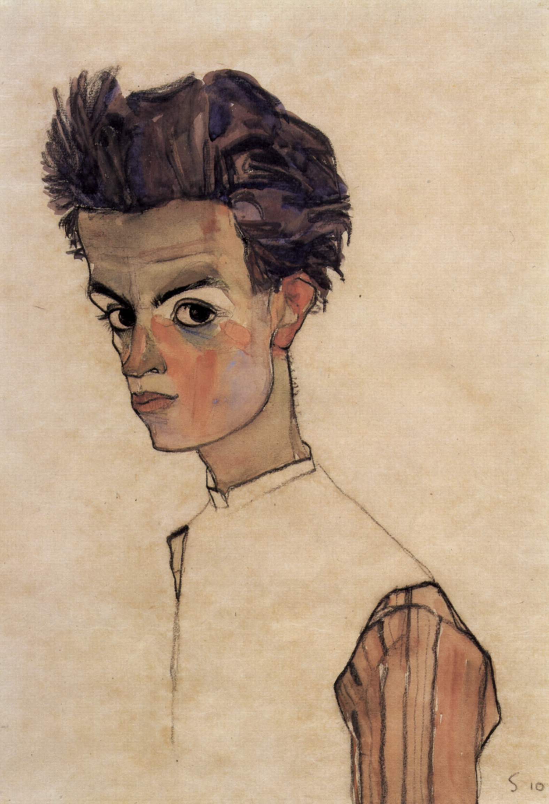

## 基本信息

- 作者：[[席勒 Egon Schiele]]
- 创作年代：1910
- 材质：（*not from wiki*）纸本 / 水彩 + 黑色粉笔
- 尺寸：（*not from wiki*）暂缺
- 现存地：（*not from wiki*）暂缺

## 画面与技法

顾衡 074 的核心案例之一——**"故意把人体画成残缺的样子"**：

> "你就算再变形再夸张，好歹胳膊腿五个手指头也得画全乎了吧？但是我们看到的是，席勒故意把人体画成残缺的样子。"

顾衡的解码：这种"残缺"**不是单纯的变形夸张，而是 [[神经官能症 Neurosis]] 的"躯体机能障碍"分类的视觉化**——把弗洛伊德框架下"力比多淤积转化为躯体症状"画成图像。

顾衡的对照（顾衡 074）：庄子笔下的**支离疏**也写过肢体畸形的人，但"身体机能有障碍，但是精神却是充盈和饱满的"——和席勒画的残缺人**完全是两回事儿**（席勒画的是病理化的残缺，庄子写的是超脱的畸人）。

## 历史背景 (*not from wiki*)

- 1910 = 席勒人物画风格成形的关键年（同年还有《[[赤裸的自画像 (席勒 1910) Self Portrait Nude (Schiele)]]》《[[轻蔑的女人 The Scornful Woman]]》）

## 图片清单

| 编号 | 出自 | 描述 |
|---|---|---|
| 01 | [[074｜席勒1：他为什么走向表现主义？]] | 全图 |

## 出现在

- [[074｜席勒1：他为什么走向表现主义？]]
