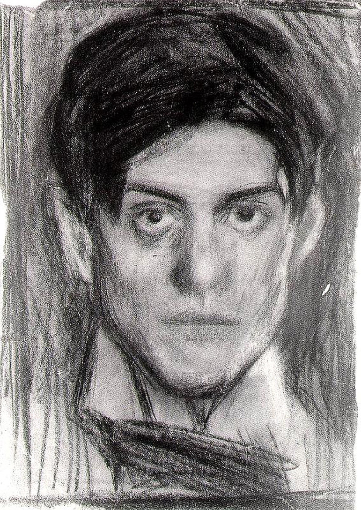

## 基本信息

- 作者：[[毕加索 Pablo Picasso]]
- 创作年代：1900
- 材质：布面油画 (*not from wiki*)
- 尺寸：年代不详 (*not from wiki*)
- 现存地：私人收藏 (*not from wiki*)

## 画面与技法

毕加索赴巴黎前夕的自画像——按本讲叙述，**在眉毛处连写了三遍"老子天下第一"**，画完即放下画笔决定去巴黎发展。19 岁的毕加索此时画风兼有西班牙学院派功底与早期个性化表达，仍未进入 [[蓝色时期 Blue Period]] 标志性的单色调。

## 历史背景 (*not from wiki*)

- 1900 年是毕加索人生的转折点——这一年他首次离开西班牙赴巴黎，开启了 [[蓝色时期 Blue Period]] 的"兼收并蓄"阶段。
- 同年稍晚他认识 [[曼雅克 Pere Mañach]]，获得每月 150 法郎的独家经营权，正式踏入巴黎画商体系。

## 图片清单

| 编号 | 出自 | 描述 |
|---|---|---|
| 01 | [[064｜毕加索1：如何理解"蓝色时期"和"玫瑰红时期"？]] | 整幅画面 |

## 出现在

- [[064｜毕加索1：如何理解"蓝色时期"和"玫瑰红时期"？]]
