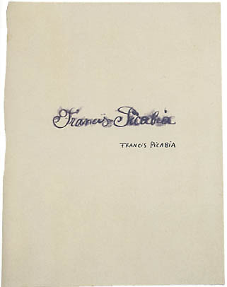

## 基本信息

- 作者：[[毕卡比亚 Francis Picabia]]
- 创作年代：1920–1922
- 材质：布面油画 (*not from wiki*)
- 尺寸：年代不详 (*not from wiki*)
- 现存地：私人收藏 (*not from wiki*)

## 画面与技法

[[毕卡比亚 Francis Picabia]] **达达无厘头期**自画像——延续"标题恶搞"思路：把签名 / 文字 / 漫画式形象作为自画像主体，与传统油画自画像背道而驰。

## 历史背景

(*not from wiki*) 1920–1922 期间，毕卡比亚作为巴黎达达总舵主主持各方达达骨干——但很快达达内部因查拉与布勒东争夺领导权而吵成一团。

## 图片清单

| 编号 | 出自 | 描述 |
|---|---|---|
| 01 | [[091｜毕卡比亚：如何用绘画表现达达主义？]] | 整体图 — 文字 / 签名式自画像 |

## 出现在

- [[091｜毕卡比亚：如何用绘画表现达达主义？]]
