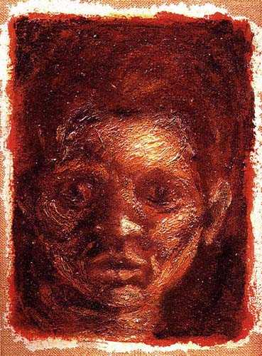

## 基本信息

- 作者：[[波洛克 Jackson Pollock]]
- 创作年代：1930
- 材质：(*not from wiki*)
- 尺寸：(*not from wiki*)
- 现存地：(*not from wiki*)

## 画面与技法

师从 [[本顿 Thomas Hart Benton]] 时期的早期具象作品。本课作为"波洛克天赋有限、基本功不行"的证据出现——"捣鼓了两三年的功夫，就是这么个水平"。

## 历史背景 (*not from wiki*)

1929 年波洛克 18 岁来到纽约，在 Art Students League 师从本顿。1930 年是他正式系统学画的早期。

## 图片清单

| 编号 | 出自 | 描述 |
|---|---|---|
| 01 | [[096｜波洛克：什么是当代艺术的第一个流派？]] | 自画像 (1930) |

## 出现在

- [[096｜波洛克：什么是当代艺术的第一个流派？]]
