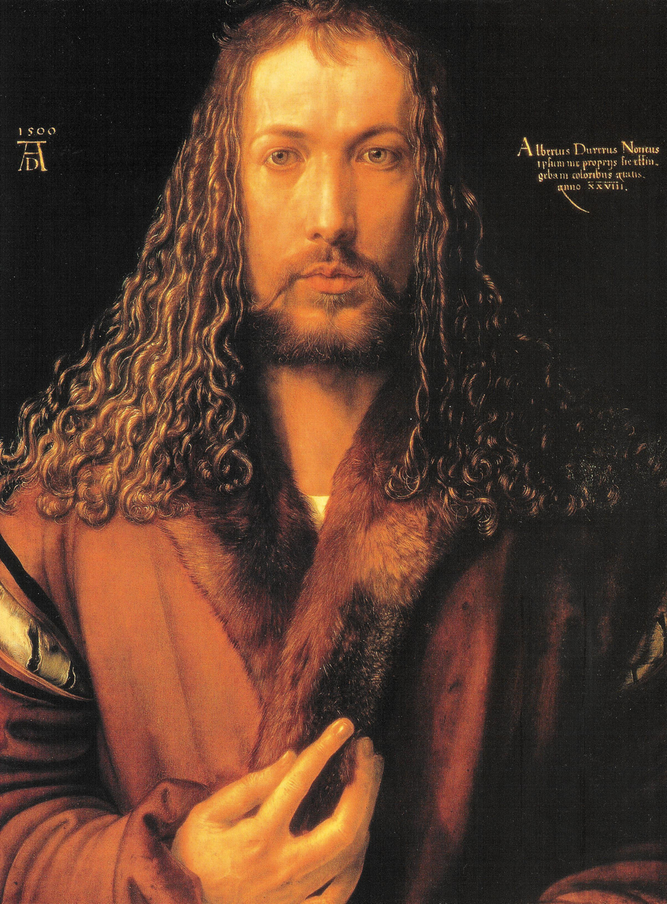

## 基本信息

- 作者：[[丢勒 Albrecht Dürer]]
- 创作年代：1500（丢勒 28-29 岁）
- 材质：油彩，椴木板 (*not from wiki*)
- 尺寸：67.1 × 48.9 cm (*not from wiki*)
- 现存地：老绘画陈列馆 (Alte Pinakothek)，慕尼黑 (*not from wiki*)

## 画面与技法

西方艺术史上**最具僭越意味的自画像之一**——[[丢勒 Albrecht Dürer]] 把自己画成了完全的**正面像**，且姿态、发型、神情明显**仿照基督的传统形象**：

- 长发披肩 + 中分
- 完全正面、目光直视观者
- 一手抬至胸前作"祝福手势"
- 暗黑背景 + 拉丁文铭文（"我，纽伦堡的阿尔布雷希特·丢勒，用永不褪色的色彩，在 28 岁时画了自己"）(*not from wiki*)

技法上对**卷发的发质与光泽**的处理被视为完美境界——[[乔万尼·贝利尼 Giovanni Bellini]] 在丢勒赴威尼斯时尤其欣赏他画头发的技法。

## 历史背景

引发巨大争议：

> 当时人们认为，只有神才有资格以完全正面的形象示人。肉身凡胎还是要谦虚，要稍微侧一下身，表现出 3/4 正面就得了。

所以连 [[蒙娜丽莎 Mona Lisa]]（达·芬奇）、[[教皇尤利乌斯二世像 Portrait of Pope Julius II]]（拉斐尔）这种顶级人物都是侧脸。丢勒按基督形象画自己，**被很多人批评为过于狂妄**。

但本作也是丢勒"**第一个热衷于画自己**"的标志——他一生画过约 10 幅自画像，这种"画家画自己"的传统由他开创。

## 图片清单

| 编号 | 出自 | 描述 |
|---|---|---|
| 01 | [[020｜丢勒：为什么版画那么重要？]] | 全图 |

## 出现在

- [[020｜丢勒：为什么版画那么重要？]]
