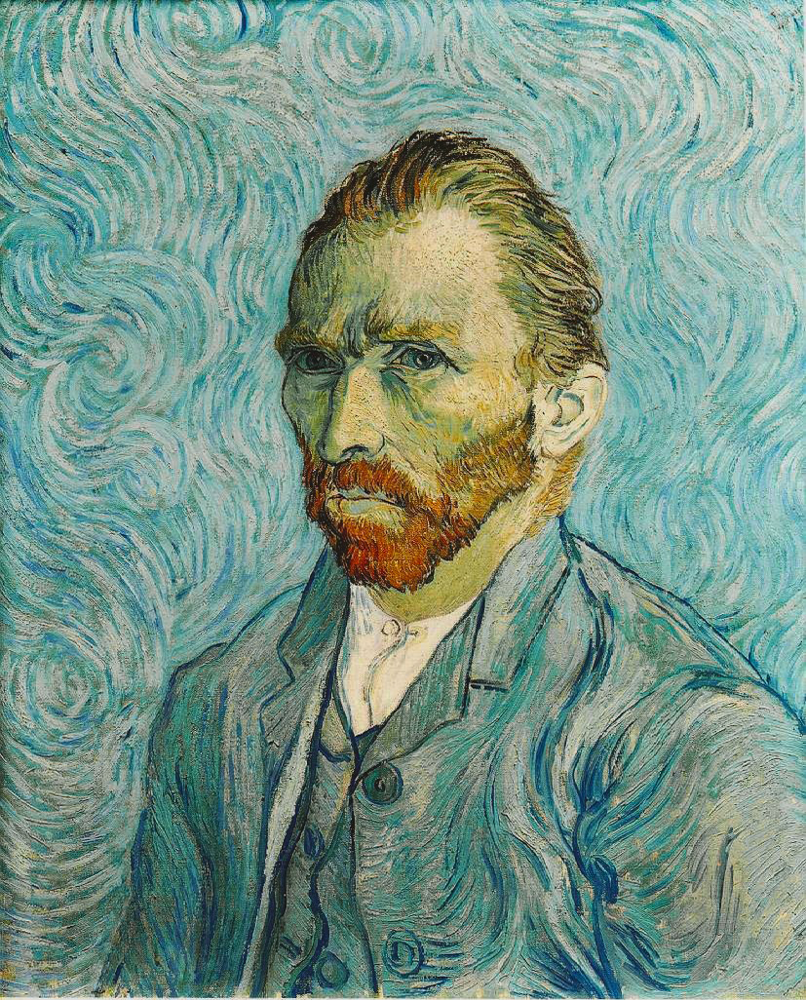

## 基本信息

- 作者：[[凡·高 Vincent van Gogh]]
- 创作年代：1889
- 材质：布面油画 (*not from wiki*)
- 尺寸：65 × 54 cm (*not from wiki*)
- 现存地：巴黎奥赛博物馆 (*not from wiki*)

## 画面与技法

圣雷米精神病院时期的自画像。漩涡式蓝绿背景与画家穿西装、目光直视观者。顾衡 059 评："以前的那个逢人就吵的杠精不见了。凡·高被生活彻底击垮了，变得胆怯而懦弱。"

## 历史背景 (*not from wiki*)

1889 年 9 月作于圣雷米；公认是凡·高最后一幅完成的自画像。

## 图片清单

| 编号 | 出自 | 描述 |
|---|---|---|
| 01 | [[059｜凡·高3：他为什么走向毁灭？]] | 圣雷米时期蓝绿漩涡背景的自画像 |

## 出现在

- [[059｜凡·高3：他为什么走向毁灭？]]
