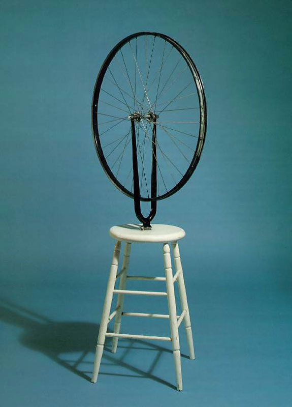

## 基本信息

- 作者：[[杜尚 Marcel Duchamp]]
- 创作年代：1913（原件遗失；后续多次复制，最有名的是 1951 复制版） (*not from wiki*)
- 材质：现成品装置——金属自行车前轮 + 上下颠倒插入木制凳子 (*not from wiki*)
- 尺寸：约 129 × 64 × 42 cm（1951 版） (*not from wiki*)
- 现存地：纽约现代艺术博物馆 (MoMA) 等多机构藏有复制件 (*not from wiki*)

## 画面与技法

杜尚 1913 年的第一件现成品装置雏形——把一个自行车前轮装在一个木凳上，轮子朝上、可以用手拨着空转。

杜尚原意"**没多想，就是觉得有个轮子没事儿转一转，挺好玩的**"——但这件装置在后来被追认为 [[现成品 Readymade]] 的开端，**比 1917 年的《[[泉 (杜尚) Fountain (Duchamp)]]》还要早四年**。

形式上：**两件未经修改的工业品的组合**——艺术家几乎不动手；艺术品的身份只取决于艺术家的"选择 + 命名"。这是 20 世纪艺术观念革命的种子。(*not from wiki*)

## 历史背景

(*not from wiki*) 1913 年版本被杜尚 1915 年搬家时随手扔掉。1951 年纽约阶段复制重做，遂成为 MoMA 镇馆作品之一。

## 图片清单

| 编号 | 出自 | 描述 |
|---|---|---|
| 01 | [[090｜杜尚3：他为什么要送一个小便器去参展？]] | 凳子上插着自行车前轮的装置照 |

## 出现在

- [[090｜杜尚3：他为什么要送一个小便器去参展？]]
