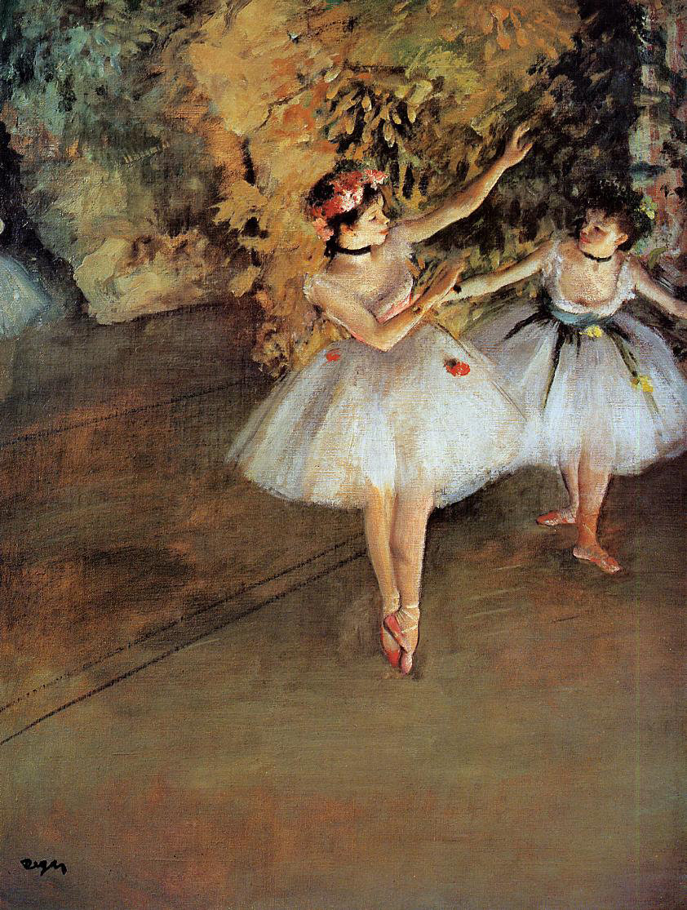

## 基本信息

- 作者：[[德加 Edgar Degas]]
- 创作年代：1874
- 材质：布面油画 (*not from wiki*)
- 尺寸：61.5 × 46 cm (*not from wiki*)
- 现存地：(*not from wiki*) 伦敦考陶尔德画廊 Courtauld Gallery

## 画面与技法

德加芭蕾舞女系列早期作品。舞台之上两位（实为三位）舞者瞬间定格，构图带有 **摄影抓拍** 般的视角——045 顾衡明示这是德加"找到能形成系列的题材，然后像照相机一样啪定格在瞬间"的方法论体现。

## 历史背景

(*not from wiki*) 创作于 1874 年——正是 [[印象派 Impressionism]] 第一次画展之年。

## 图片清单

| 编号 | 出自 | 描述 |
|---|---|---|
| 01 | [[045｜德加：为什么印象派以他结束？]] | 舞台上两位舞女 |

## 出现在

- [[045｜德加：为什么印象派以他结束？]]
