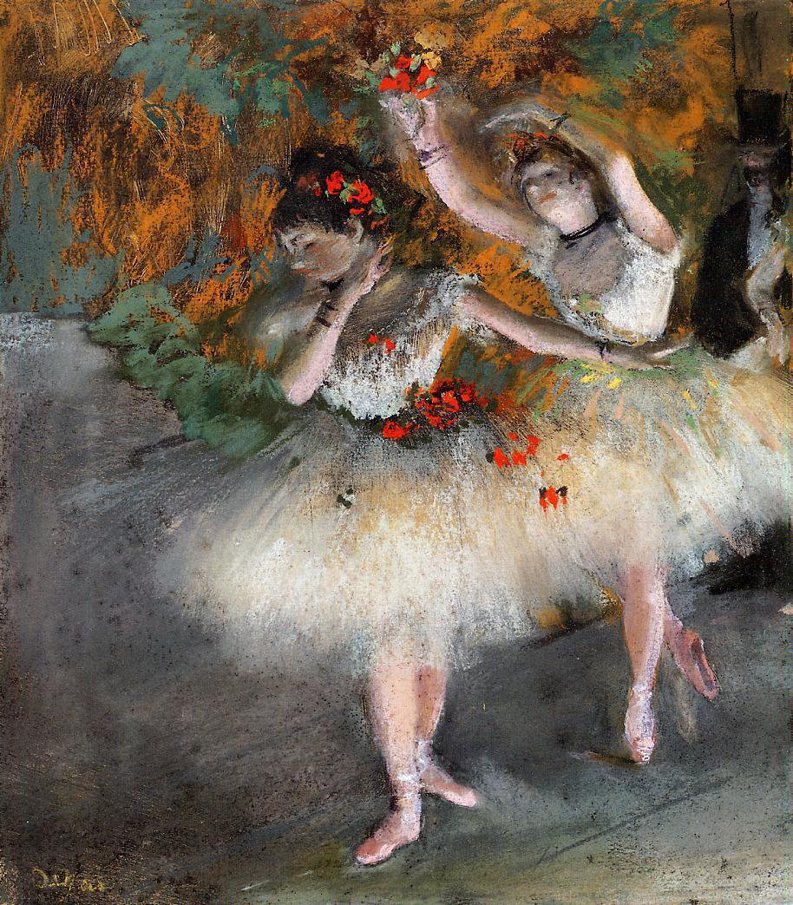

## 基本信息

- 作者：[[德加 Edgar Degas]]
- 创作年代：1877–1878
- 材质：粉彩 / 单刻版画 (*not from wiki*)
- 尺寸：(*not from wiki*)
- 现存地：(*not from wiki*) 哈佛艺术博物馆 Harvard Art Museums

## 画面与技法

舞女登台前的瞬间——德加典型的 **后台 / 准备状态** 取景。045 顾衡指出："相比于演员在舞台上的大放异彩，德加更感兴趣的却是她们在后台不雅的姿态"。

## 历史背景

(*not from wiki*) 1870 年代末德加开始大量使用粉彩与单刻版画 (monotype) 技法。

## 图片清单

| 编号 | 出自 | 描述 |
|---|---|---|
| 01 | [[045｜德加：为什么印象派以他结束？]] | 舞女登台前的瞬间 |

## 出现在

- [[045｜德加：为什么印象派以他结束？]]
