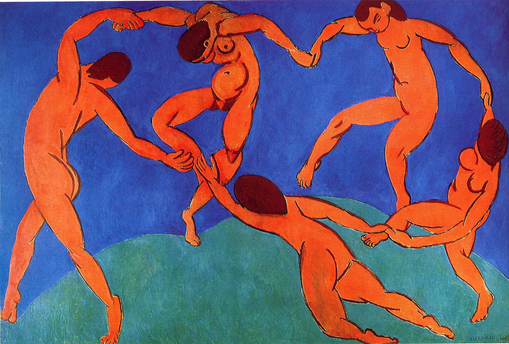

## 基本信息

- 作者：[[马蒂斯 Henri Matisse]]
- 创作年代：1910
- 材质：油画 (*not from wiki*)
- 尺寸：(*not from wiki*)
- 现存地：(*not from wiki* 圣彼得堡 / 冬宫博物馆)
- 委托人：[[史楚金 Sergei Shchukin]]

## 画面与技法

与 [[音乐 (马蒂斯) Music (Matisse)]] 构成 1910 年为 [[史楚金 Sergei Shchukin]] 创作的**双联壁**——062 顾衡定性："**这两幅作品，可以被视为马蒂斯走出野兽派之后的代表作。**"

要点（062）：

- 看似原始人的舞蹈，**其实是法兰多拉舞 (Farandole)**——"**当时在巴黎蒙马特地区非常流行**"
- 与《音乐》形成对比：**一动一静，一明一暗**
- 色彩全部 [[平涂 Flat Colour]]，**没有表现阴影**——"绘画的所有要素都被简化为极致"
- 体现"**色与形之间和谐的关系**"——[[柏格森 Henri Bergson]] 的 [[直觉 Intuition (Bergson)]] 与理性被翻译为颜色与形状的关系
- 配套宣言："**画面上一切无用的东西都是有害的。任何多余的细节，都会影响观众心灵对主要部分的领会。**"

## 历史背景 *(not from wiki)*

(*not from wiki*) 1910 年为俄国收藏家 [[史楚金 Sergei Shchukin]] 莫斯科宅邸装饰委托所作，与《音乐》同期。现存圣彼得堡冬宫博物馆。这是马蒂斯一生最具识别度的作品之一，常被印刷为 20 世纪现代艺术的代表性图像。

## 图片清单

| 编号 | 出自 | 描述 |
|---|---|---|
| 01 | [[062｜马蒂斯3：如何理解他一生的创作？]] | 五人手拉手舞蹈 / 蓝绿底色 / 红色人物 |

## 出现在

- [[062｜马蒂斯3：如何理解他一生的创作？]] —— 马蒂斯走出野兽派之后的代表作之一
