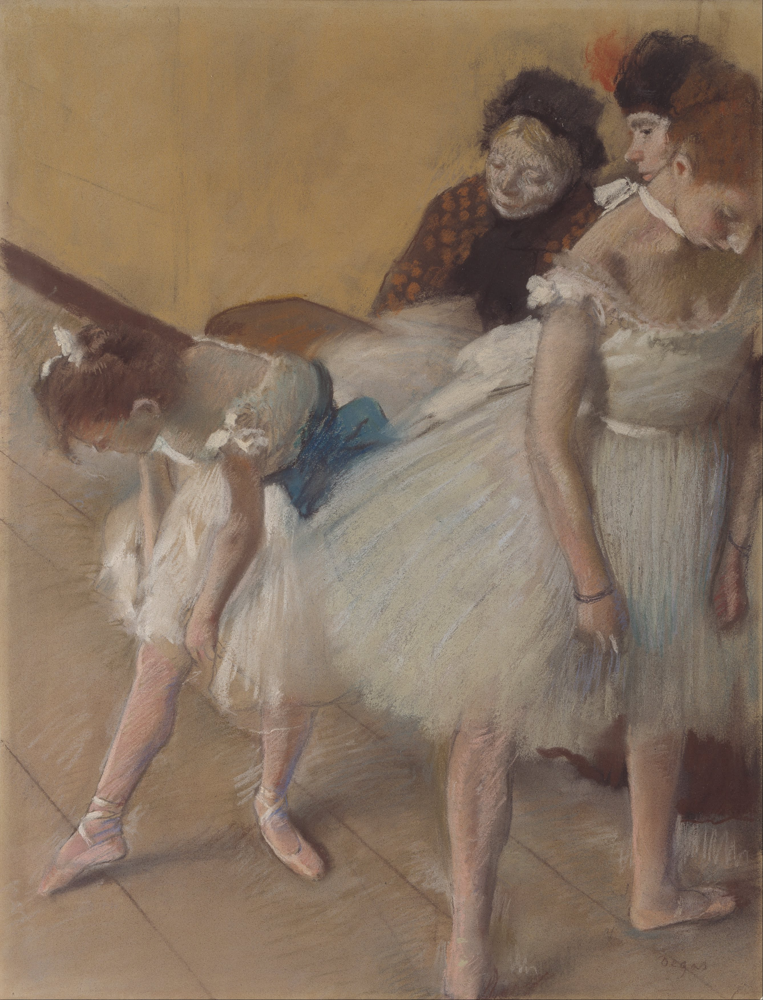

## 基本信息

- 作者：[[德加 Edgar Degas]]
- 创作年代：约 1880
- 材质：纸上粉彩与炭笔 (*not from wiki*)
- 尺寸：63.4 × 48.2 cm (*not from wiki*)
- 现存地：(*not from wiki*) 丹佛美术馆 Denver Art Museum

## 画面与技法

舞女在考试场景中的等待与放松状态——**站立、揉脚、调整鞋带**——德加从这些"不雅"动作中萃取女性身体的固有线条。045 顾衡评述："他笔下的舞女，打呵欠、整理鞋带、揉搓疼痛的脚，都是那么的美。"

## 历史背景

(*not from wiki*) 1880 年代巴黎歌剧院的小芭蕾舞演员（"小老鼠 petits rats"）——多为穷人家女孩、训练严苛、收入低下。德加画的"考试"具有真实的社会人类学价值。

## 图片清单

| 编号 | 出自 | 描述 |
|---|---|---|
| 01 | [[045｜德加：为什么印象派以他结束？]] | 等待考试的舞女 |

## 出现在

- [[045｜德加：为什么印象派以他结束？]]
