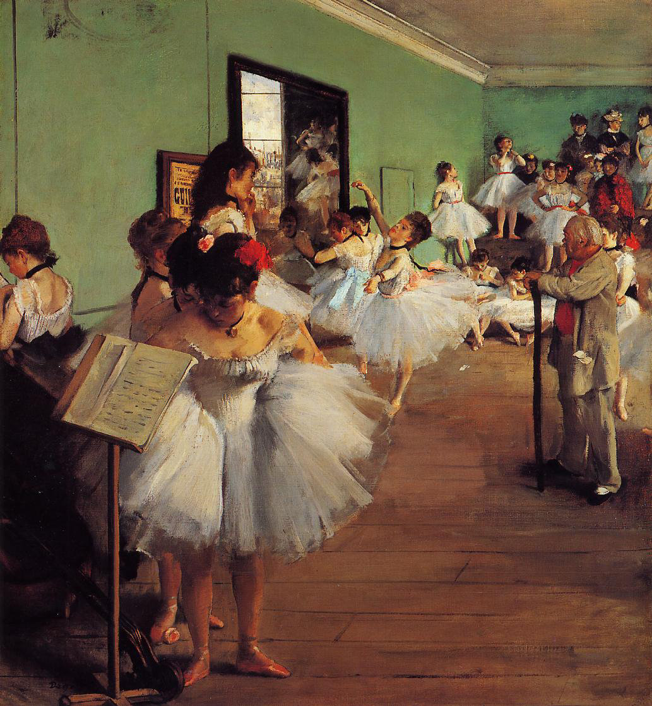

## 基本信息

- 作者：[[德加 Edgar Degas]]
- 创作年代：1874
- 材质：布面油画 (*not from wiki*)
- 尺寸：85 × 75 cm (*not from wiki*)
- 现存地：(*not from wiki*) 巴黎奥赛博物馆 Musée d'Orsay

## 画面与技法

德加最广为人知的芭蕾舞女作品之一——大型群像，**前景与中景的舞者各自处于放松状态**（揉腰、抓痒、拉袜、绕领带），后景是站立的老芭蕾大师 Jules Perrot 拄拐杖。

045 顾衡指出："女性什么状态下的线条，才最有可能与古代大师形成有效沟通呢？当然是她们最放松、最自然的状态。舞台表演效果，反而是要被刻意回避的。"

## 历史背景

(*not from wiki*) 创作于 1874 年第一次印象派画展同年。也是德加从"巴黎歌剧院老剧院"（火灾前）转向"加尼叶歌剧院"取景的过渡时期。

## 图片清单

| 编号 | 出自 | 描述 |
|---|---|---|
| 01 | [[045｜德加：为什么印象派以他结束？]] | 排练厅群像 + 老大师拄杖 |

## 出现在

- [[045｜德加：为什么印象派以他结束？]]
