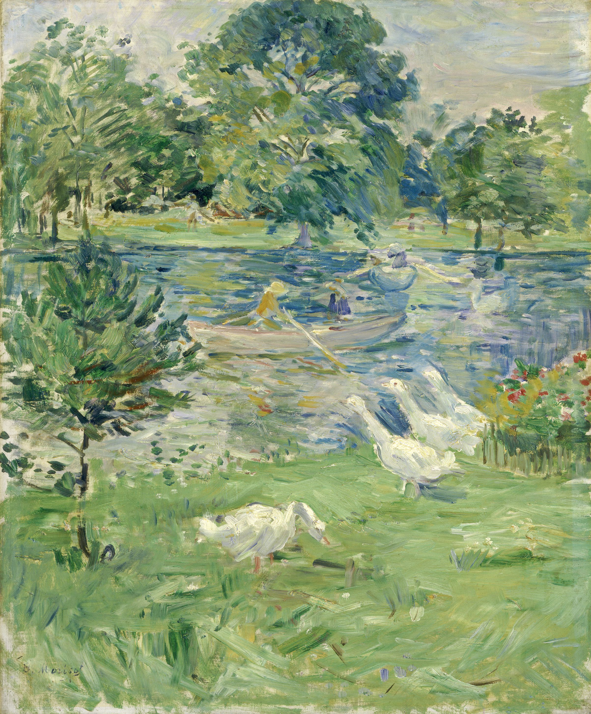

## 基本信息

- 作者：[[莫利索 Berthe Morisot]]
- 创作年代：1889
- 材质：布面油画 (*not from wiki*)
- 尺寸：(*not from wiki*) 约 65 × 54 cm
- 现存地：(*not from wiki*) 私人收藏

## 画面与技法

[[莫利索 Berthe Morisot]] 的成熟期作品——少女坐于轻舟之上、水面下有白鹅游弋。整幅画以**细碎马赛克式笔触**铺陈水光、衣裙与背景——是顾衡 044 用来展示"**莫利索从来没有背弃过印象派的创作理念**"的代表样本之一。

## 在课程中的角色

顾衡 044 把它与《[[穿衣镜 The Psyche Mirror]]》《[[餐厅 (莫利索) In the Dining Room]]》《[[摇篮 The Cradle]]》一同列为**莫利索贯彻印象派理念的样本组**——"**即使是画人物的脸部，莫利索也坚持不用平涂，丝毫不妥协。她的这个画法，就是最纯粹的印象派。**"

## 图片清单

| 编号 | 出自 | 描述 |
|---|---|---|
| 01 | [[044｜莫利索和毕沙罗：最纯正的印象派什么样？]] | 全画 |

## 出现在

- [[044｜莫利索和毕沙罗：最纯正的印象派什么样？]] —— 莫利索"印象派教科书"样本之一
- [[莫利索 Berthe Morisot]] —— 代表作之一
