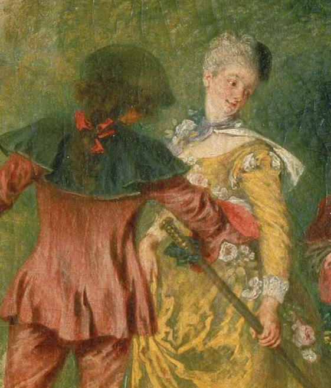

## 基本信息

- 作者：[[华托 Antoine Watteau]]
- 创作年代：1717 (顾衡题为 1718) (*not from wiki*) —— 此画曾作为华托 1717 申请法兰西皇家美术学院院士的"接纳之作"
- 材质：布面油画 (*not from wiki*)
- 尺寸：129 × 194 cm (*not from wiki*)
- 现存地：巴黎卢浮宫 Louvre, Paris (*not from wiki*) —— 另有 1718-1719 同主题版本藏柏林夏洛滕堡宫 (Schloss Charlottenburg, Berlin)

## 画面与技法

[[雅宴画 fête galante]] 最著名一幅。希腊神话中**西苔岛 (Cythera) 是爱神 [[阿弗洛狄忒 (维纳斯) Aphrodite (Venus)]] 的故乡**——"大家都说去了西苔岛，一定能找到自己的意中人"。

画面右侧丘陵上有一尊维纳斯像（被花环缠绕）；几对衣着华美的贵族情侣构成一条**蜿蜒的下行队列**——年长那对正在依依话别、中间那对扶起女子、远处那对已牵手走向左下方的金舟。空中有小爱神飞舞。

**顾衡的考据**（028）：

> 如此说来，华托的这幅《舟发西苔岛》应该叫《**西苔岛惜别**》才对，因为画的不都是一对儿一对儿的情侣在伤离别吗？

——情侣其实是在 **"返回"** 而非"出发"前往西苔岛；中文标题"舟发"易引误解。

**胖的褶子细节**（02 局部）：华托笔下女人**也还是够胖的**，画胖出的一身褶子被顾衡评为"佛兰德斯画家让人没法理解的恶趣味"——这是顾衡判定华托"登堂未入室"的视觉证据。

## 历史背景

(*not from wiki*) 1717 华托以此画为题材的版本作为 *peintre des fêtes galantes*（雅宴画家）被法兰西皇家美术学院特别录取——美术学院为他单独创设了"雅宴画"这一画种类别。

## 图片清单

| 编号 | 出自 | 描述 |
|---|---|---|
| 01 | [[028｜什么是洛可可？]] | 整体图 |
| 02 | [[028｜什么是洛可可？]] | 局部（女性胴体褶子） |

## 出现在

- [[028｜什么是洛可可？]]
