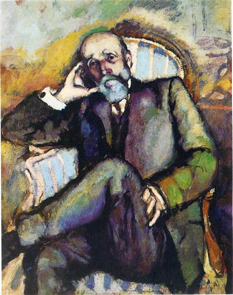

## 基本信息

- 作者：[[杜尚 Marcel Duchamp]]
- 创作年代：1910
- 材质：油画 (*not from wiki*)
- 尺寸：约 92 × 73 cm (*not from wiki*)
- 现存地：费城美术馆 Philadelphia Museum of Art (*not from wiki*)

## 画面与技法

本讲（088）作为杜尚 1910 年"**塞尚期**"代表出场——与《[[下棋 (杜尚 1910) Chess Game]]》《[[两个裸女 (杜尚 1910) Two Nudes (Duchamp)]]》并列，**受 [[塞尚 Paul Cézanne]] 的影响显而易见**。

但杜尚与塞尚的关键区别（顾衡判词，是理解杜尚日后艺术走向的钥匙）：

- **塞尚**以科学家自居，要"找出绘画各要素之间和谐的关系"，**避免画面有具体寓意**。
- **杜尚**追求的是**观念**，要让画**呈现脑子里的想法**，作品里有 [[象征主义 Symbolism]] 式的"寓意"。

模特是杜尚父亲——布兰维尔小镇的公证人（用妻子嫁妆买下业务、靠信息不对称发了财，但又"特别讲道理"地资助六个孩子里四个去搞艺术）。

## 历史背景

(*not from wiki*) 杜尚的塞尚期只持续约一年；该作品也是他对父亲家长身份的回应。

## 图片清单

| 编号 | 出自 | 描述 |
|---|---|---|
| 01 | [[088｜杜尚1：他"好好画画"是什么样子的？]] | 整体图——塞尚式坐像 |

## 出现在

- [[088｜杜尚1：他"好好画画"是什么样子的？]]
