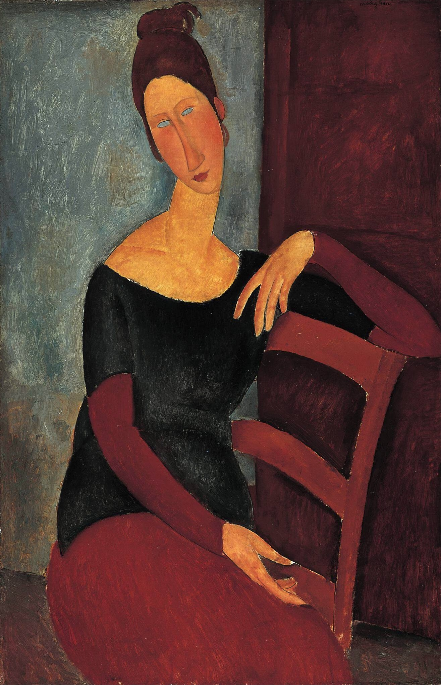

## 基本信息

- 作者：[[莫迪里阿尼 Amedeo Modigliani]]
- 创作年代：1918
- 材质：布面油画 (*not from wiki*)
- 尺寸：(*未知*)
- 现存地：(*未知；多版本散布欧美*) (*not from wiki*)

## 画面与技法

[[莫迪里阿尼 Amedeo Modigliani]] 为妻子 [[珍妮·赫比特娜 Jeanne Hébuterne]] 所作肖像之一。延续他成熟期的统一程式——长鼻、长颈、空白或灰矇的眼睛。

顾衡 078 解读莫迪里阿尼晚期肖像的眼睛：

> 眼睛要么是全黑没有眼白，要么是像大理石雕像一样一片灰矇，妖媚得近似鬼魅。

晚期为珍妮所作的画作中，眼睛**逐渐填实**——直到 1919 年 [[珍妮·赫比特娜像 (莫迪里阿尼 1919) Portrait of Jeanne Hébuterne]] 那一幅他终于"**画出珍妮睁开眼睛的样子**"。

## 历史背景 (*not from wiki*)

珍妮 1917 年认识莫迪里阿尼时是 19 岁的美院学生；二人未正式登记婚姻，但事实同居至 1920 年莫迪里阿尼病逝。珍妮在丈夫去世第二天跳楼自杀，时怀身孕九个月。

## 图片清单

| 编号 | 出自 | 描述 |
|---|---|---|
| 01 | [[078｜莫迪里阿尼：画中女子为什么让人一眼难忘？]] | 珍妮长颈半身 |

## 出现在

- [[078｜莫迪里阿尼：画中女子为什么让人一眼难忘？]]
