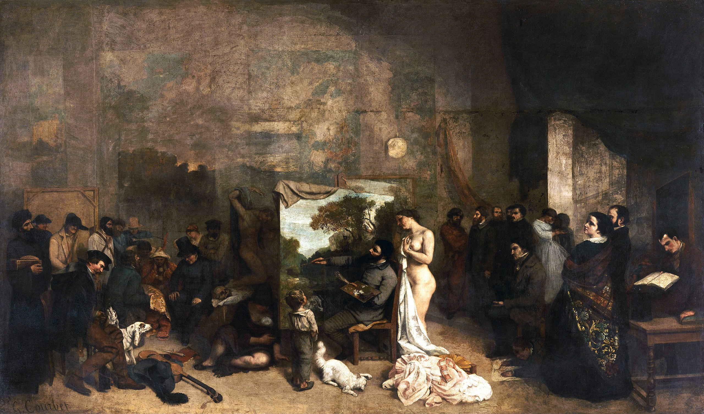

## 基本信息

- 作者：[[居斯塔夫·库尔贝 Gustave Courbet]]
- 创作年代：1855
- 材质：布面油画 (*not from wiki*)
- 尺寸：约 **3 米多 × 6 米多**（顾衡 035 明示；实测约 361 × 598 cm）
- 现存地：巴黎奥赛博物馆 Musée d'Orsay, Paris (*not from wiki*)

## 画面与技法

库尔贝自己居中作画——左侧是他描绘的"日常人物群像"（农民、神父、乞丐、商人 …）；右侧是他的朋友们（[[波德莱尔 Charles Baudelaire]] 等知识分子）。画作副标题：**《我七年艺术与道德生活的真实寓言》**。(*not from wiki*)

## 历史背景

**1855 法国第一次世博会沙龙——库尔贝送两幅画（本作 + [[奥尔南的葬礼 A Burial at Ornans]]），都落选**（顾衡 035 明示）。落选后：

> 库尔贝就办了个个人画展，门口树了个大牌子，上面写着"**现实主义，库尔贝，个人 40 件作品展览**"。他还办了本杂志，杂志的名字就叫《现实主义》。

—— 这是 [[现实主义 Realism]] 流派"**命名 + 立旗**"的关键事件。

## 图片清单

| 编号 | 出自 | 描述 |
|---|---|---|
| 01 | [[035｜库尔贝：为什么现实主义的开创者争议那么大？]] | 全幅，库尔贝居中作画、左右两组人物 |

## 出现在

- [[035｜库尔贝：为什么现实主义的开创者争议那么大？]]
