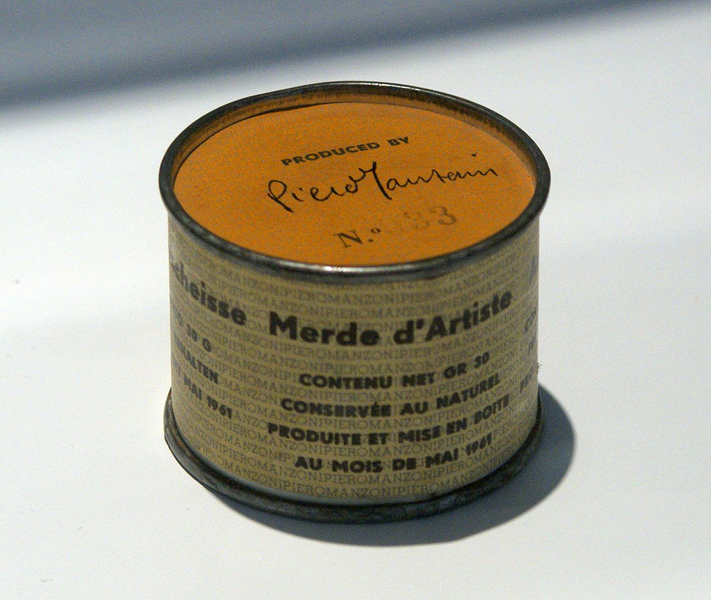

## 基本信息

- 作者：[[皮耶罗·曼佐尼 Piero Manzoni]]
- 创作年代：1961
- 材质：金属罐头（罐装"艺术家的粪便"，净重 30 克 / 罐）
- 数量：90 个编号罐头 (*not from wiki*)
- 尺寸：单罐约 4.8 × 6.5 cm (*not from wiki*)
- 现存地：分散于多家美术馆与私人收藏（Tate、MoMA、Centre Pompidou 等藏有编号副本） (*not from wiki*)

## 画面与技法

90 个标准罐头，标签印有四种语言（意 / 英 / 法 / 德）的"艺术家的粪便 · 净重 30 克 · 新鲜保存 · 1961 年 5 月生产 + 罐装"，每罐编号 1–90 (*not from wiki*)。

**定价机制**（顾衡 099 核心引）：

- 单罐定价 **37 美元**——精确对应**当时 30 克黄金的金价**（1 盎司黄金 = 35 美元，约 31.1g）
- 曼佐尼明确声明：**价格随金价波动**——这是 [[当代艺术 Contemporary Art]] 史上第一次把作品价格直接锚定到通用金融指数
- 2016 年：其中一罐在米兰拍出 **27.5 万欧元**——约为 30 克黄金市值的 **500 倍**——成为 [[布雷顿森林协议解体 Bretton Woods Collapse]] 之后法币超发 / 艺术品价格暴涨的**最浓缩范例**

## 历史背景

(*not from wiki*) 曼佐尼此作意图是**恶搞 [[当代艺术 Contemporary Art]] 圈**——把 [[杜尚 Marcel Duchamp]] 1917 [[泉 (杜尚) Fountain (Duchamp)]] 的"现成品挑衅"推到极限：连"选物"这一步都省了，艺术家自己排泄的东西也照算艺术。结果艺术市场照单全收。

罐头里到底装的是什么，长期是悬案——2007 年一项检测显示某些罐头可能内装石膏，曼佐尼家族也未确认；部分罐头多年后渗漏破裂导致内容物外泄（这本身又被当作艺术事件） (*not from wiki*)。

## 图片清单

| 编号 | 出自 | 描述 |
|---|---|---|
| 01 | [[099｜大便罐头到NFT：当代艺术的界限在哪里？]] | 罐头正面（标签 "Artist's Shit / Contenuto netto gr. 30 / Conservato al naturale / Prodotto ed inscatolato / nel maggio 1961"） |

## 出现在

- [[099｜大便罐头到NFT：当代艺术的界限在哪里？]]
