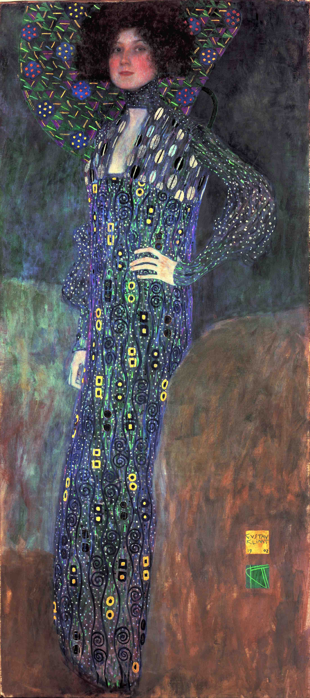

## 基本信息

- 作者：[[克里姆特 Gustav Klimt]]
- 创作年代：1902
- 材质：（*not from wiki*）布面油画
- 尺寸：（*not from wiki*）181 × 84 cm
- 现存地：（*not from wiki*）维也纳博物馆 Wien Museum

## 画面与技法

[[克里姆特 Gustav Klimt]] 名媛肖像系列代表作之一——画的是终生密友、情人、模特 [[艾米莉·弗洛奇 Emilie Flöge]]。

顾衡 073 把这幅作品放在惠斯勒样式 → 克里姆特名媛肖像 → 阿黛尔夫人像金箔风格的演化链条中间——人物神情姿势仍是 [[惠斯勒 James Whistler]] 式，但开始出现装饰图案前景化的倾向（*not from wiki*）。

## 历史背景 (*not from wiki*)

- raw caption 写作「艾米莉·弗雷格 Emilie Floge」——本 wiki 用权威拼写 **Emilie Flöge / 艾米莉·弗洛奇**，将原拼写收入 aliases
- 该肖像被弗洛奇本人嫌弃，从未挂在她家里

## 图片清单

| 编号 | 出自 | 描述 |
|---|---|---|
| 01 | [[073｜克里姆特：什么是维也纳分离派？]] | 艾米莉·弗洛奇站姿肖像 |

## 出现在

- [[073｜克里姆特：什么是维也纳分离派？]]
