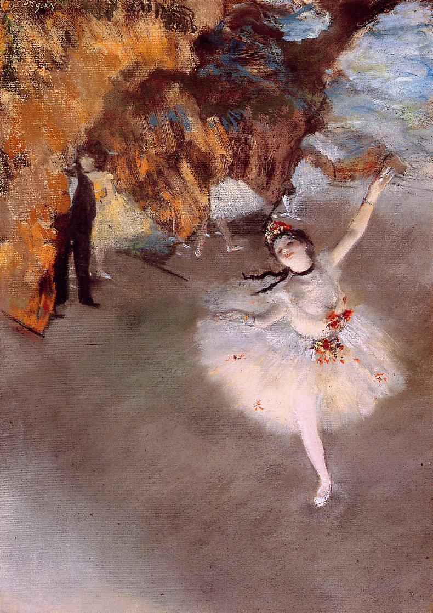

## 基本信息

- 作者：[[德加 Edgar Degas]]
- 创作年代：1878
- 材质：纸上粉彩 (*not from wiki*)
- 尺寸：58 × 42 cm (*not from wiki*)
- 现存地：(*not from wiki*) 巴黎奥赛博物馆 Musée d'Orsay

## 画面与技法

德加最著名的芭蕾舞女作品之一——前景独舞者的旋转动作，后景阴影中可见包厢里的"赞助人"——**俯视视角**与剧场顶部包厢的并置，是德加典型的 **照相机式抓拍** 构图 (*not from wiki*)。

045 顾衡明示：德加捕捉芭蕾舞女是为了 **"萃取出女性身体所特有的线条系统"**——把现代人的形体翻译为可以"与 [[拉斐尔 Raphael]]、[[提香 Titian]] 这些前辈形成沟通"的线条密电码。

## 历史背景

(*not from wiki*) 1878 年正值印象派第三、四次画展间——是德加芭蕾系列最鼎盛的阶段。

## 图片清单

| 编号 | 出自 | 描述 |
|---|---|---|
| 01 | [[045｜德加：为什么印象派以他结束？]] | 独舞者旋转，背景包厢阴影 |

## 出现在

- [[045｜德加：为什么印象派以他结束？]]
