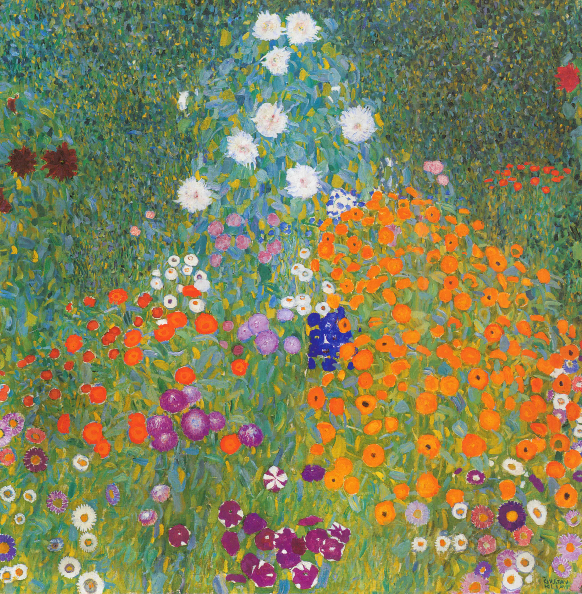

## 基本信息

- 作者：[[克里姆特 Gustav Klimt]]
- 创作年代：1907
- 材质：（*not from wiki*）布面油画
- 尺寸：（*not from wiki*）110 × 110 cm
- 现存地：（*not from wiki*）私人收藏

## 画面与技法

与 [[阿特湖中的小岛 Island in the Attersee]] 同属克里姆特**向现代绘画转型尝试期间**的作品——"明显体现出 [[印象派 Impressionism]] 的技术特点"（顾衡 073）。

近似方形构图、铺满花朵，是克里姆特晚期"花园 / 农园"风景系列代表（*not from wiki*）。

## 历史背景 (*not from wiki*)

属于克里姆特"金色时期"前后过渡时段创作的萨尔茨卡默古特乡村花园系列。

## 图片清单

| 编号 | 出自 | 描述 |
|---|---|---|
| 01 | [[073｜克里姆特：什么是维也纳分离派？]] | 花园全图 |

## 出现在

- [[073｜克里姆特：什么是维也纳分离派？]]
