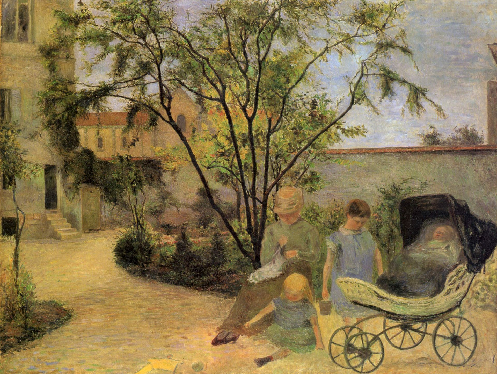

## 基本信息

- 作者: [[高更 Paul Gauguin]]
- 创作年代: 1881
- 材质: 布面油画 (*not from wiki*)
- 尺寸: 年代不详
- 现存地: (*not from wiki*) 哥本哈根新嘉士伯美术馆 Ny Carlsberg Glyptotek（待核）

## 画面与技法

高更早期作品——典型的[[印象派 Impressionism]]风格，可见[[毕沙罗 Camille Pissarro]]影响下的小笔触、自然光、家庭生活场景。顾衡 055 引为"1874 年高更认识毕沙罗后，1880 年起参加第五到第八届印象派画展期间"的早期代表。

## 历史背景 (*not from wiki*)

1881 年高更尚为巴黎股票经纪人——业余作画，已被[[毕沙罗 Camille Pissarro]]力排众议接纳进印象派画展（044 / 055 一致）。

## 图片清单

| 编号 | 出自 lecture | 描述 |
|---|---|---|
| 01 | [[055｜高更1：为什么从印象派走向象征主义？]] | 全图 |

## 出现在

- [[055｜高更1：为什么从印象派走向象征主义？]]
