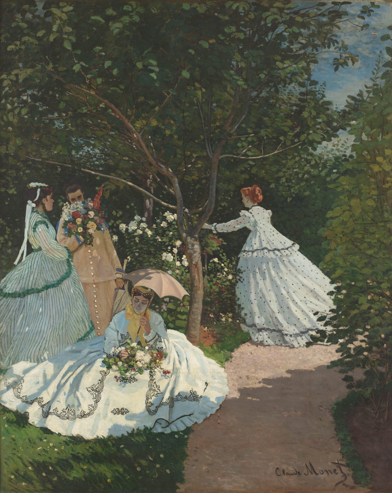

## 基本信息

- 作者：[[莫奈 Claude Monet]]
- 创作年代：1866（041 caption）
- 材质：布面油画 (*not from wiki*)
- 尺寸：**205 × 260 cm**（041 顾衡明示）
- 现存地：(*not from wiki*) —— 巴黎奥赛博物馆 Musée d'Orsay

## 画面与技法

041 顾衡详谈的莫奈早期重要作品。模特之一是 [[卡美伊·东西厄 Camille Doncieux]]。技术节点全部由 041 给出：

1. **坚持户外完成**——尺寸虽达 205×260 cm，莫奈仍在户外作画。因画太大，莫奈**在花园里挖了一条沟，画上面的时候就把画架降到沟里去**。这是 041 最具传奇色彩的细节，也是莫奈"户外完成"理念偏执程度的最佳证据。
2. **离开 [[居斯塔夫·库尔贝 Gustave Courbet]]**——库尔贝曾跑来看了好几次、给了很多建议，**但正是在这幅大画中莫奈反而走得离库尔贝越来越远**。原因可能是：库尔贝此时正"按学院派路子画些裸女和风景"，让年轻画家产生逆反心理。所以"**你库尔贝强调阔大原则，我莫奈偏要用细碎的小笔触，来表现光的颤动**"。
3. **统一光线**——莫奈坚持**只在每天差不多的时间画画**，让"从天空到树叶，再到卡美伊阳光下的裙子和阳伞下的脸庞，都处于统一的光线之下"。
4. **白色打底**——041 顾衡的关键技法对照："**库尔贝和学院派一样，都是用深色打底，而莫奈在这幅画中却选用白色打底。这样一来，整个作品的亮度就提起来了。**" 这是后来印象派整体亮度的源头。

## 历史背景

041 经济叙事：
- [[巴齐依 Frédéric Bazille]] 以 **2500 法郎** 高价买下，且以**每月 50 法郎分期付款**——避免莫奈两口子一次性把钱"造光"。
- 此举既是友情救济，也实质上是早期印象派最重要的内部赞助行为。

(*not from wiki*) 此画被 1867 沙龙拒收。1921 年法国国家收购，存奥赛。

## 图片清单

| 编号 | 出自 | 描述 |
|---|---|---|
| 01 | [[041｜莫奈1：颠覆式的创新从何而来？]] | 花园中四位女子，统一光线、白色打底 |

## 出现在

- [[041｜莫奈1：颠覆式的创新从何而来？]]
