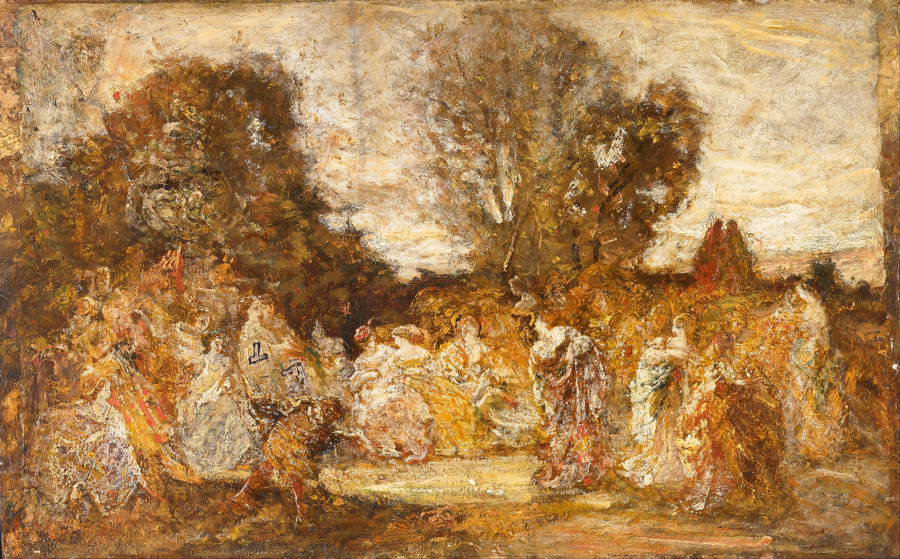

## 基本信息

- 作者：[[蒙蒂切利 Adolphe Monticelli]]
- 创作年代：约 1870
- 材质：(*not from wiki*) 木板油画
- 尺寸：(*not from wiki*) 39.7 × 56 cm
- 现存地：(*not from wiki*) 私人收藏

## 画面与技法

[[蒙蒂切利 Adolphe Monticelli]] 招牌式的**厚涂**——颜料堆叠到可触摸的厚度，物像几乎被颜料的物理体积所"吃掉"。058 中顾衡以此画解释凡·高为何"对蒙蒂切利的厚涂爱得不行、夸张到管人家叫爸爸的程度"——并直接在给 [[提奥 Theo van Gogh]] 的信中宣称"**我不过是在继续着他的工作**"。

因此凡·高巴黎期的**笔触尺度明显大于典型印象派**，是 058 列出的"凡·高偏离印象派的第一点"。

## 历史背景 (*not from wiki*)

蒙蒂切利长期在马赛工作，画作在他生前并不被巴黎主流接受，但厚涂、瑰丽色彩与梦幻题材吸引了同为"外省进京"的凡·高——后者 1886 年到达巴黎后第一时间在画廊里发现他。蒙蒂切利 1886 年去世，凡·高此后多次写信哀悼。

## 图片清单

| 编号 | 出自 | 描述 |
|---|---|---|
| 01 | [[058｜凡·高2：为什么他的风格难以界定？]] | 整幅画作，厚涂样本 |

## 出现在

- [[058｜凡·高2：为什么他的风格难以界定？]]
