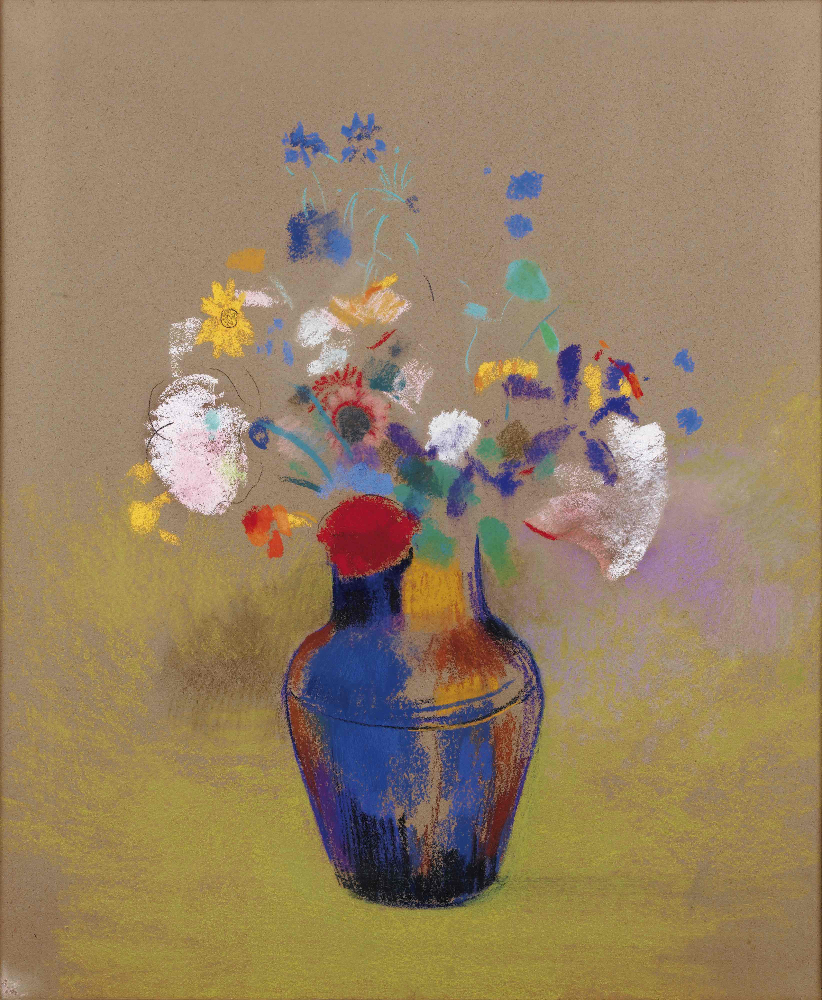

## 基本信息

- 作者：[[雷东 Odilon Redon]]
- 创作年代：1910
- 材质：粉彩 / 油彩（*not from wiki*）
- 尺寸：年代不详
- 现存地：未注明

## 画面与技法

雷东晚期花卉静物——与同年《[[花瓶中的花 Flowers in a Vase]]》《[[维纳斯的诞生 (雷东) The Birth of Venus (Redon)]]》等一同体现雷东 **"形状叙事弱化 + 色彩饱和"** 的晚期方案。顾衡 051 把这种处理理解为 [[象征主义 Symbolism]] "大铁鸟变奏" 在绘画中的延伸（[[大铁鸟 (货物崇拜) Cargo Cult]]）。

## 历史背景 (*not from wiki*)

参考《[[花瓶中的花 Flowers in a Vase]]》历史背景注。

## 图片清单

| 编号 | 出自 | 描述 |
|---|---|---|
| 01 | [[051｜雷东：怪诞是不是象征主义的方向？]] | 雷东 1910 瓶花 |

## 出现在

- [[051｜雷东：怪诞是不是象征主义的方向？]]
