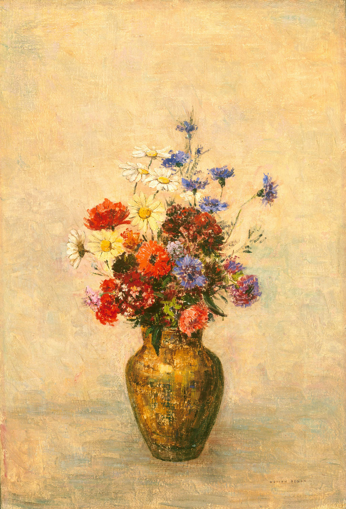

## 基本信息

- 作者：[[雷东 Odilon Redon]]
- 创作年代：1909
- 材质：粉彩 / 油彩（*not from wiki*：雷东晚期花卉系列多以粉彩或油彩绘成）
- 尺寸：年代不详
- 现存地：未注明

## 画面与技法

雷东晚期花卉静物——**鲜艳颜色 + 故意弱化形状和叙事主题**。顾衡 051 把雷东的这种"对形的放弃"对应到 [[马拉美 Stéphane Mallarmé]] "对词语的放弃"——理解为 [[大铁鸟 (货物崇拜) Cargo Cult]] 的视觉变奏。

## 历史背景 (*not from wiki*)

雷东 1900 年代后从早期 noirs 转向饱和粉彩，瓶花成为其晚期最重要的母题之一——影响了纳比派与早期野兽派的色彩观。

## 图片清单

| 编号 | 出自 | 描述 |
|---|---|---|
| 01 | [[051｜雷东：怪诞是不是象征主义的方向？]] | 雷东 1909 瓶花 |

## 出现在

- [[051｜雷东：怪诞是不是象征主义的方向？]]
