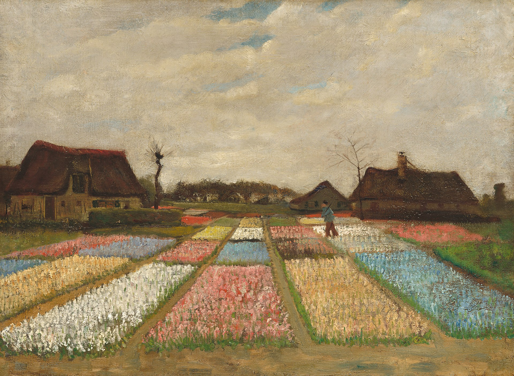

## 基本信息

- 作者：[[凡·高 Vincent van Gogh]]
- 创作年代：1883
- 材质：油画板上的油画 (*not from wiki*)
- 尺寸：—
- 现存地：海牙市立博物馆 (*not from wiki*)

## 画面与技法

凡·高 1883 年在海牙时期所作。057 中作为"凡·高在画廊干过，进步还是很快"的证据之一出现——他叔叔柯尔此时还为其订了 12 幅插画。

## 历史背景 (*not from wiki*)

凡·高在海牙期间（1882 春–1883 秋）的代表作之一，是他少有的早期色彩明亮作品。荷兰球茎花田是国民图像母题；该画也是凡·高从素描转向油画的早期实验。

## 图片清单

| 编号 | 出自 | 描述 |
|---|---|---|
| 01 | [[057｜凡·高1：为什么说他"性格决定命运"？]] | 凡·高 1883 年《花田》 |

## 出现在

- [[057｜凡·高1：为什么说他"性格决定命运"？]]
