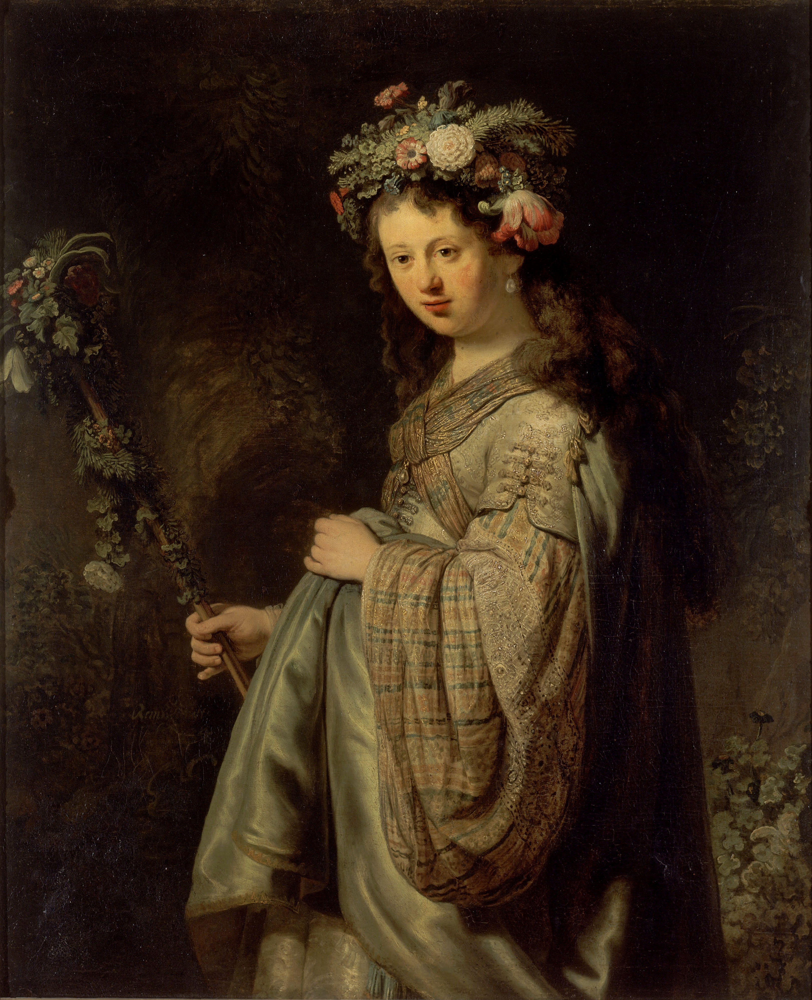

## 基本信息

- 作者：[[伦勃朗 Rembrandt]]
- 创作年代：1634
- 材质：油画 (*not from wiki*)
- 模特：[[莎斯基亚 Saskia van Uylenburgh]]（伦勃朗的妻子）
- 现存地：圣彼得堡 埃尔米塔日博物馆 (*not from wiki*)

## 画面与技法

伦勃朗与 [[莎斯基亚 Saskia van Uylenburgh]] 婚后第一年作。把妻子画成罗马花卉与春天女神 Flora——既是夫妻甜蜜期的肖像，也是借古典神话给市民阶层做形象拔高的典型操作。

## 历史背景

1634 年伦勃朗刚娶到市长之女 [[莎斯基亚 Saskia van Uylenburgh]]，她的嫁妆和她叔叔（荷兰最大画廊老板）的人脉让伦勃朗一举进入上流社会名媛圈，并使他后来有能力**置办大工作室收 15 个徒弟**——这是伦勃朗"工作室品牌"商业模式的起点。

## 图片清单

| 编号 | 出自 | 描述 |
|---|---|---|
| 01 | [[026｜伦勃朗2：为什么荷兰收费最高的画家会破产？]] | 莎斯基亚作为花神模特 |

## 出现在

- [[026｜伦勃朗2：为什么荷兰收费最高的画家会破产？]]
