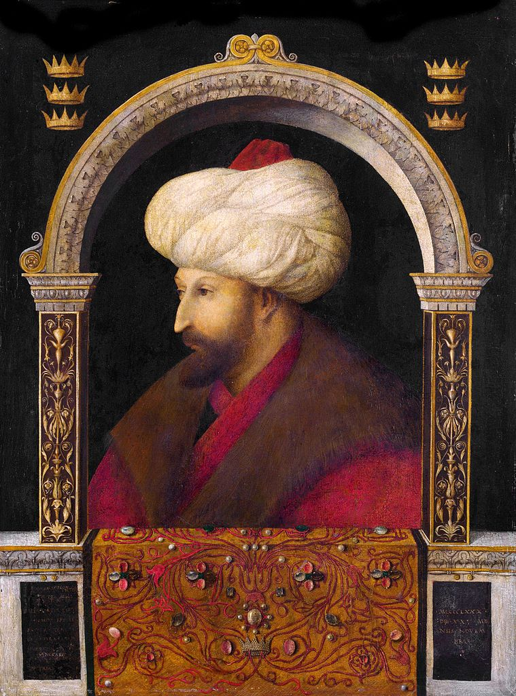

## 基本信息

- 作者：**真蒂莱·贝利尼** (Gentile Bellini, c.1429–1507) —— [[乔万尼·贝利尼 Giovanni Bellini]] 的哥哥
- 创作年代：1480 (*not from wiki*)
- 材质：布面油画 (转移自木板)
- 尺寸：69.9 × 52.1 cm (*not from wiki*)
- 现存地：伦敦国家美术馆 (The National Gallery, London) (*not from wiki*)

## 画面与技法

侧面四分之三胸像。**奥斯曼帝国苏丹穆罕默德二世** (Mehmed II, 1432–1481, 1453 年攻陷君士坦丁堡的征服者) 透过文艺复兴式拱框观看——表面看是一个标准的意大利文艺复兴肖像，但被画者是**帝国与基督教世界宿敌**——这一矛盾构成本作的历史张力。

## 历史背景

(*not from wiki*) 1479 年威尼斯与奥斯曼帝国签订和约后，苏丹邀请威尼斯派一位画家到伊斯坦布尔为他作像。威尼斯参议会派出 真蒂莱·贝利尼——他在伊斯坦布尔待了 18 个月，画了苏丹与多位廷臣的肖像。

土耳其作家 帕慕克 在小说《我的名字叫红》中提到这段史实——一个穆斯林苏丹**用基督教式的写实肖像呈现自己**的禁忌选择 (按伊斯兰传统反对偶像崇拜)，是小说的核心张力之一。

顾衡 015 用它作为 [[威尼斯画派 Venetian School]] 早期国际影响的例证。

## 图片清单

| 编号 | 出自 | 描述 |
|---|---|---|
| 01 | [[015｜乔尔乔内：威尼斯画派创新在何处？]] | 整体图 |

## 出现在

- [[015｜乔尔乔内：威尼斯画派创新在何处？]]
