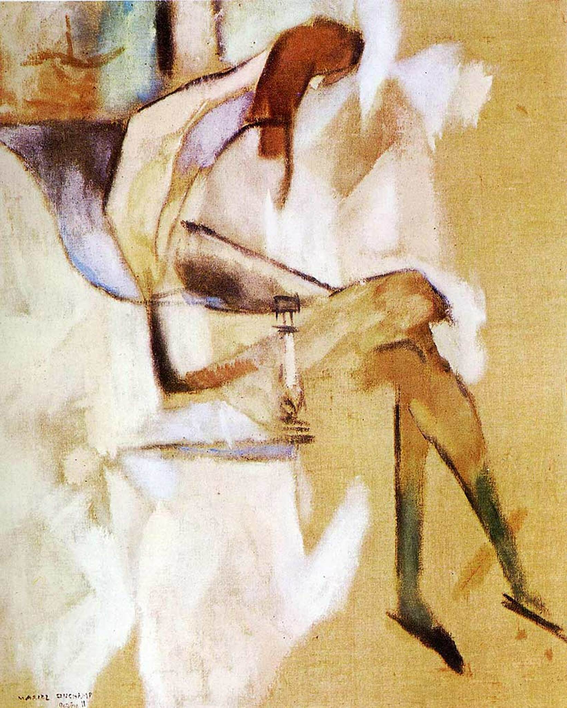

> raw caption 给的英文是 "About Young Sister"——这可能是顾衡用的非标准译名；按英美博物馆/学界惯例 "Portrait of Suzanne Duchamp" 更通行。两个名字都收入 aliases。

## 基本信息

- 作者：[[杜尚 Marcel Duchamp]]
- 创作年代：1911
- 材质：油画 (*not from wiki*)
- 尺寸：约 110 × 90 cm (*not from wiki*)
- 现存地：费城美术馆 Philadelphia Museum of Art (*not from wiki*)

## 画面与技法

本讲（088）作为杜尚 1911 年[[分析立体主义 Analytical Cubism]]期最详细讨论的一幅——"挺有意思，值得多说几句"。

**两个关键视觉特征**：
1. **妹妹被画得异常瘦** —— "正常人不可能有这么瘦"。
2. **身体四周一圈白** —— 这一圈白色不是随意为之，而是**模仿 [[X 射线 X-ray]] 片的效果**。

**X 光母题的来源**：
- 1895 年伦琴发明 X 光，"说有一种射线能穿墙走壁毫发无损"——大家都觉得"啊呀，真是好神奇"。
- 1900s 初科学焦虑（四维空间 / 相对论 / 没人真懂）催生各种怪力乱神。
- 画家们很喜欢在作品中表现 X 光效果——杜尚有一阵子很痴迷。

模特是杜尚的妹妹苏珊娜·杜尚——也是一位艺术家 (*not from wiki*)，与三位哥哥一起构成"六个孩子中四个学艺术"的家庭格局。

## 历史背景

(*not from wiki*) 1911 年杜尚正式加入 [[皮托集团 Puteaux Group]] 同期作品；杜尚日后笔记表明他对四维空间 / 黎曼几何研究深入准确——X 光只是该时期"科学母题"组合中的一个。

## 图片清单

| 编号 | 出自 | 描述 |
|---|---|---|
| 01 | [[088｜杜尚1：他"好好画画"是什么样子的？]] | 整体图——瘦弱身体周围一圈白模仿 X 光片效果 |

## 出现在

- [[088｜杜尚1：他"好好画画"是什么样子的？]]
