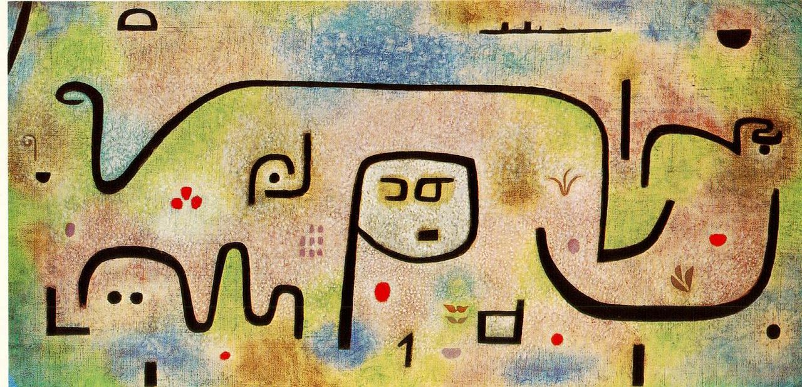

## 基本信息

- 作者：[[克利 Paul Klee]]
- 创作年代：1938
- 材质：油画或水彩 (*not from wiki*)
- 现存地：(*not from wiki*)

## 画面与技法

[[克利 Paul Klee]] 1938 年作。1933 年希特勒上台后，克利离开德国回到瑞士伯尔尼定居；此后受 [[硬皮症 Scleroderma]] (*not from wiki*) 折磨。本时期画风转向**更简练厚重的符号化笔触**——粗黑线条与扁平色块。

## 历史背景

(*not from wiki*) 与 [[孩童与阿姨 Child and Aunt]]、[[蓝色大衣 Blue Coat]]、[[中毒 Intoxication]]、[[死与火 Death and Fire]] 同属克利生命最后几年的作品；此时他被纳粹列为"[[颓废艺术 Degenerate Art]]"，作品在德国被没收。

## 图片清单

| 编号 | 出自 | 描述 |
|---|---|---|
| 01 | [[085｜克利：他为什么模仿小孩子画画？]] | 晚期厚黑线条 + 扁平色块 |

## 出现在

- [[085｜克利：他为什么模仿小孩子画画？]]
