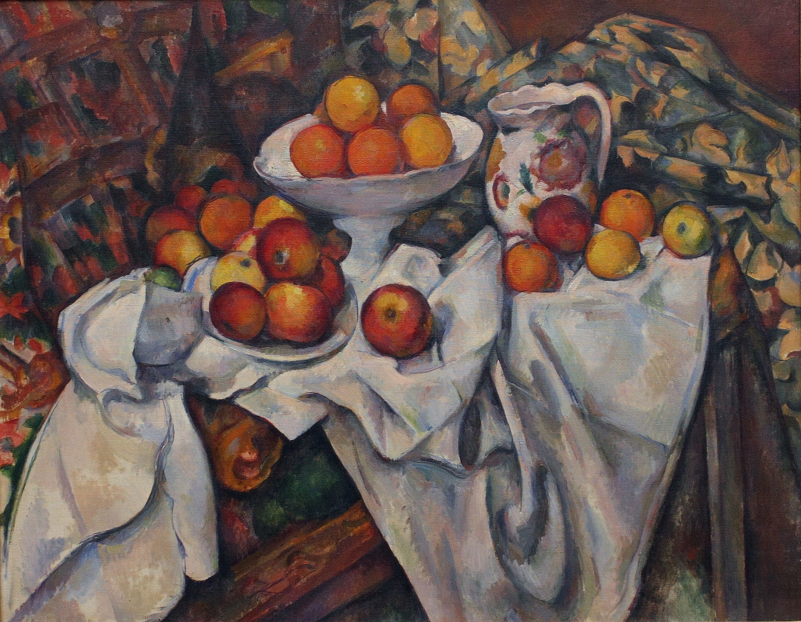

## 基本信息

- 作者：[[塞尚 Paul Cézanne]]
- 创作年代：1900 前后（顾衡 054 标注；常见标注 c.1899）
- 材质：油彩，画布 (*not from wiki*)
- 尺寸：(*not from wiki*) 约 74 × 93 cm
- 现存地：(*not from wiki*) 法国巴黎奥赛博物馆 (Musée d'Orsay)

## 画面与技法

[[塞尚 Paul Cézanne]] 成熟期水果静物代表作。顾衡 054 将其与 [[三个梨 Three Pears]]、[[青瓜和静物 Still Life with Green Melon]] 并列，作为塞尚**晚期水果静物中线条重新出现**的样本——

> 在塞尚晚期的水果静物中出现了线条。但是，塞尚从未背弃用颜色来塑造形体的艺术原则，并未试图用线条来表现形状。

塞尚自述："**一经动笔，绘画和颜色就不再有区分。颜色越是协调，绘画就会变得越明确。当颜色达到最丰富时，形也就会变得越饱满。颜色的反差和关系，是绘画及造型的秘密。**"

操作要点：桌布的褶皱、果盘的曲线、水果的轮廓——形状之间相互呼应、产生**"一种形状仅与其相邻的形状有关"** 的局部关系网（054 顾衡）。这是塞尚"几何骨骼 + 主观色彩"成熟期方法论的静物版示范。

## 历史背景 (*not from wiki*)

《苹果和橘子》是塞尚静物系列的巅峰之一，1900 年前后创作。这一时期他几乎只在画室静物（apple、pear、melon）与圣维多利亚山之间循环——前者解决"纯形式问题"、后者解决"风景中的形式问题"。本作进入奥赛博物馆是 20 世纪初塞尚被官方接纳的重要节点。

## 图片清单

| 编号 | 出自 | 描述 |
|---|---|---|
| 01 | [[054｜塞尚3：为什么理解塞尚那么困难？]] | 全图——成熟期水果静物代表 |

## 出现在

- [[054｜塞尚3：为什么理解塞尚那么困难？]] —— 水果静物母题的成熟样本；晚期线条出现
