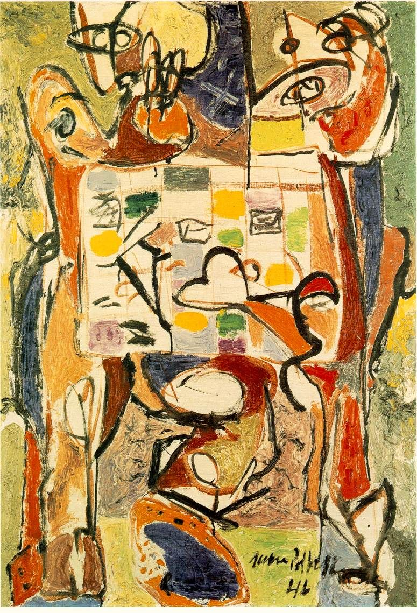

## 基本信息

- 作者：[[波洛克 Jackson Pollock]]
- 创作年代：1946
- 材质：(*not from wiki*)
- 尺寸：(*not from wiki*)
- 现存地：(*not from wiki*)

## 画面与技法

波洛克滴画法觉醒前一年的作品。顾衡评论："还是 [[超现实主义 Surrealism]] 自动绘画那一套，还是跟在法国人屁股后面跑，这怎么行呢？"——刺激美国艺术界寻找"原创美国风格"的紧迫感。

## 历史背景 (*not from wiki*)

1946 年二战刚结束，美国上下空前膨胀，迫切要求在理论和实践层面取得突破性进展。

## 图片清单

| 编号 | 出自 | 描述 |
|---|---|---|
| 01 | [[096｜波洛克：什么是当代艺术的第一个流派？]] | 茶杯 The Tea Cup (1946) |

## 出现在

- [[096｜波洛克：什么是当代艺术的第一个流派？]]
